# 01 เว็บสำหรับผู้เยี่ยมชม

เริ่มจากหน้าแรก ค้นหาและอ่านข้อมูลสินค้า ก่อนสมัครหรือเข้าสู่ระบบ ภาพในโฟลเดอร์นี้เปิดได้โดยไม่ใช้บัญชี

ภาพในโฟลเดอร์: **11 หน้า**

## 01. หน้าแรก

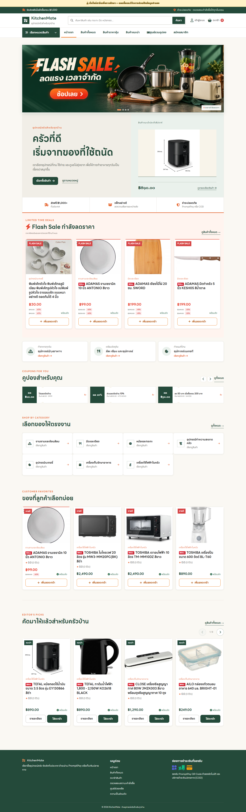

**สิ่งที่แสดง:** แบนเนอร์ เมนูค้นหา หมวดสินค้า โปรโมชัน และจุดเริ่มต้นการเลือกซื้อ

**วิธีใช้งาน:** ใช้แถบค้นหาด้านบนหรือเปิดเมนูหมวดสินค้า จากนั้นคลิกแบนเนอร์หรือการ์ดสินค้าเพื่อไปต่อ

**ตำแหน่งหน้า:** `index.php`

## 02. สินค้าทั้งหมด

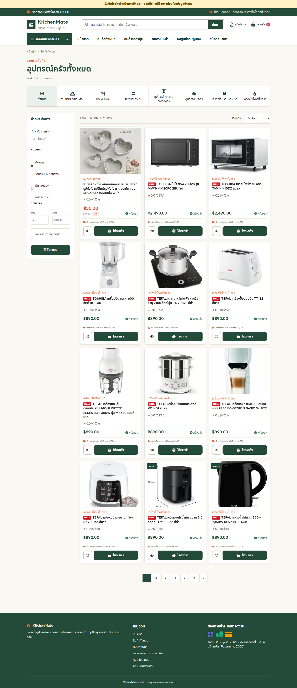

**สิ่งที่แสดง:** รายการสินค้า ตัวกรองหมวด ช่วงราคา และตัวเลือกการเรียง

**วิธีใช้งาน:** เลือกหมวดทางแถบด้านข้าง ปรับช่วงราคา/สต็อก และเปลี่ยนการเรียง ก่อนคลิกสินค้าที่สนใจ

**ตำแหน่งหน้า:** `products.php`

## 03. รายละเอียดสินค้า

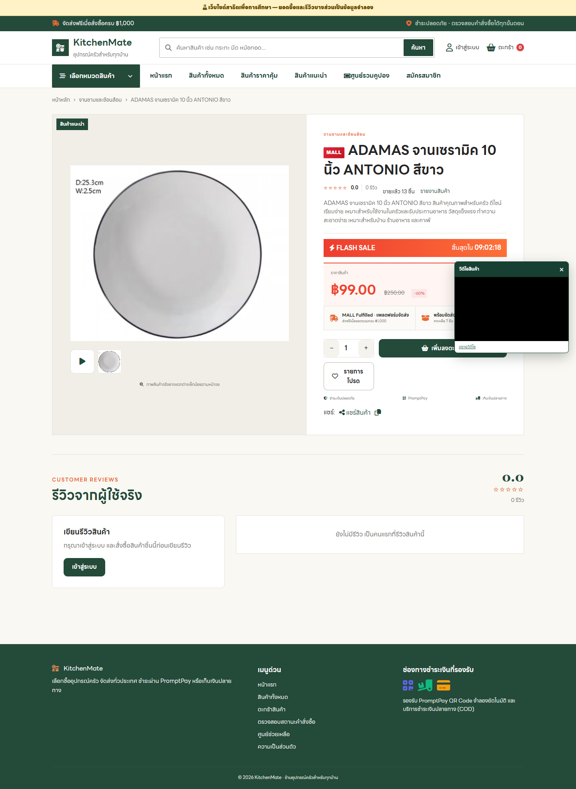

**สิ่งที่แสดง:** ภาพ ราคา ตัวเลือก จำนวน รีวิว และปุ่มเพิ่มตะกร้า

**วิธีใช้งาน:** ตรวจภาพ ชื่อ ราคา สต็อก และรายละเอียด เลือกจำนวน แล้วกดเพิ่มลงตะกร้า; เลื่อนลงเพื่ออ่านรีวิว

**ตำแหน่งหน้า:** `product-detail.php?id=19`

## 04. หน้าร้านผู้ขาย

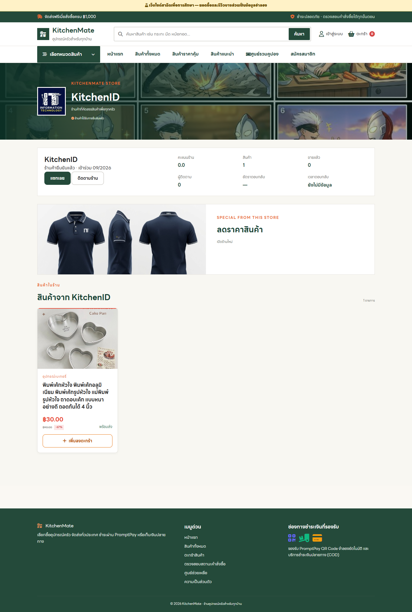

**สิ่งที่แสดง:** ข้อมูลร้าน รายการสินค้า และทางติดต่อผู้ขาย

**วิธีใช้งาน:** ดูชื่อร้าน คะแนนและสินค้าของร้าน ใช้ปุ่มติดตามหรือแชทเมื่อเข้าสู่ระบบแล้ว

**ตำแหน่งหน้า:** `shop.php?id=222`

## 05. ตะกร้าผู้เยี่ยมชม

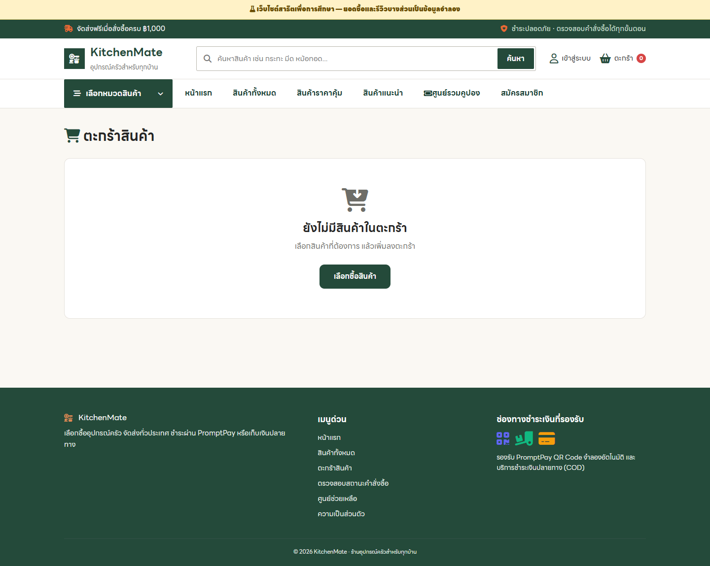

**สิ่งที่แสดง:** การแสดงตะกร้าก่อนเข้าสู่ระบบหรือก่อนเพิ่มสินค้า

**วิธีใช้งาน:** เมื่อยังไม่มีสินค้า ระบบแสดงสถานะตะกร้าว่าง กดเลือกซื้อสินค้าเพื่อกลับไปหน้ารายการ

**ตำแหน่งหน้า:** `cart.php`

## 06. เข้าสู่ระบบ

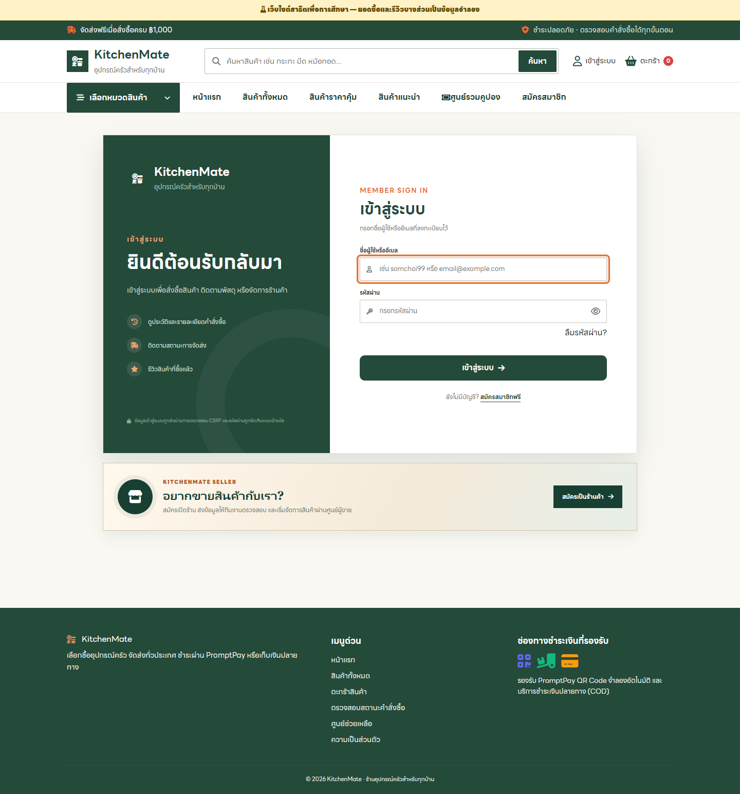

**สิ่งที่แสดง:** แบบฟอร์มชื่อผู้ใช้หรืออีเมลและรหัสผ่าน

**วิธีใช้งาน:** กรอกชื่อผู้ใช้/อีเมลและรหัสผ่าน แล้วกดเข้าสู่ระบบ; ใช้ลิงก์ลืมรหัสผ่านหากจำไม่ได้

**ตำแหน่งหน้า:** `login.php`

## 07. สมัครสมาชิก

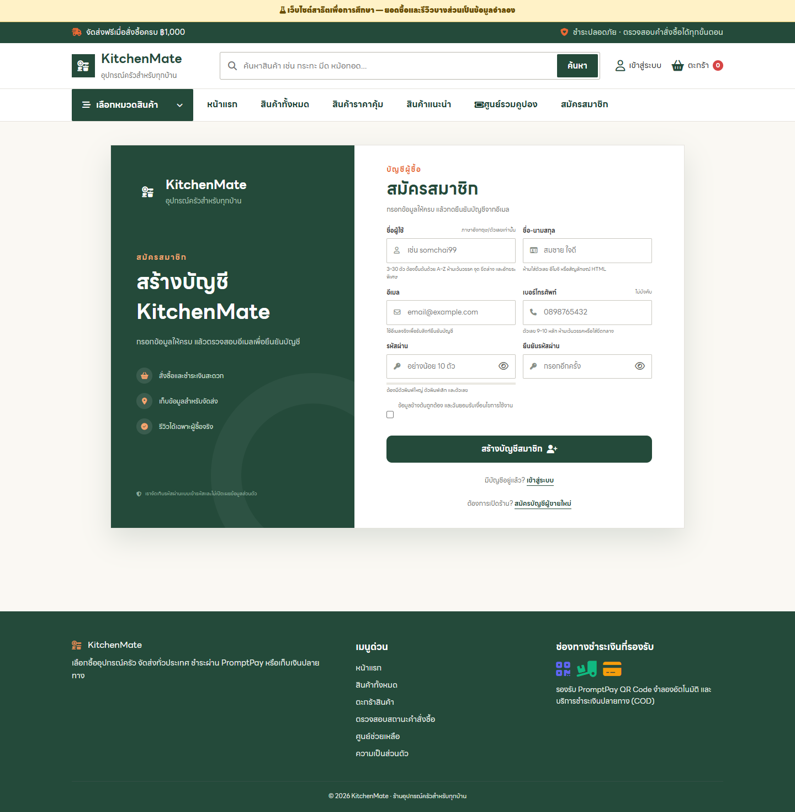

**สิ่งที่แสดง:** แบบฟอร์มสร้างบัญชีลูกค้า

**วิธีใช้งาน:** กรอกข้อมูลบัญชี ยอมรับเงื่อนไข แล้วส่งแบบฟอร์ม จากนั้นทำขั้นตอนยืนยันอีเมลตามที่เว็บแจ้ง

**ตำแหน่งหน้า:** `register.php`

## 08. สมัครผู้ขาย

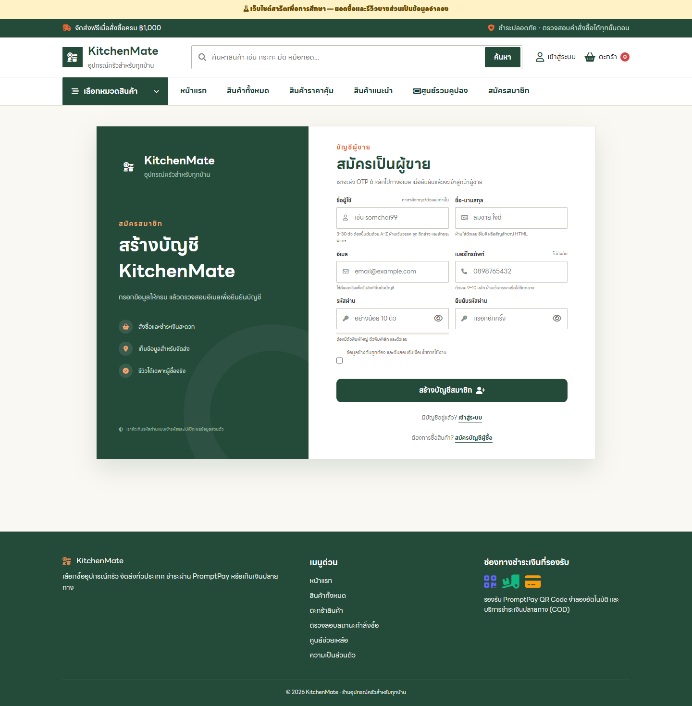

**สิ่งที่แสดง:** แบบฟอร์มสร้างบัญชีผู้ขาย

**วิธีใช้งาน:** เลือกสมัครเป็นผู้ขาย กรอกข้อมูลติดต่อและรหัสผ่าน จากนั้นยืนยันอีเมลและข้อมูลร้าน

**ตำแหน่งหน้า:** `seller-register.php`

## 09. ลืมรหัสผ่าน

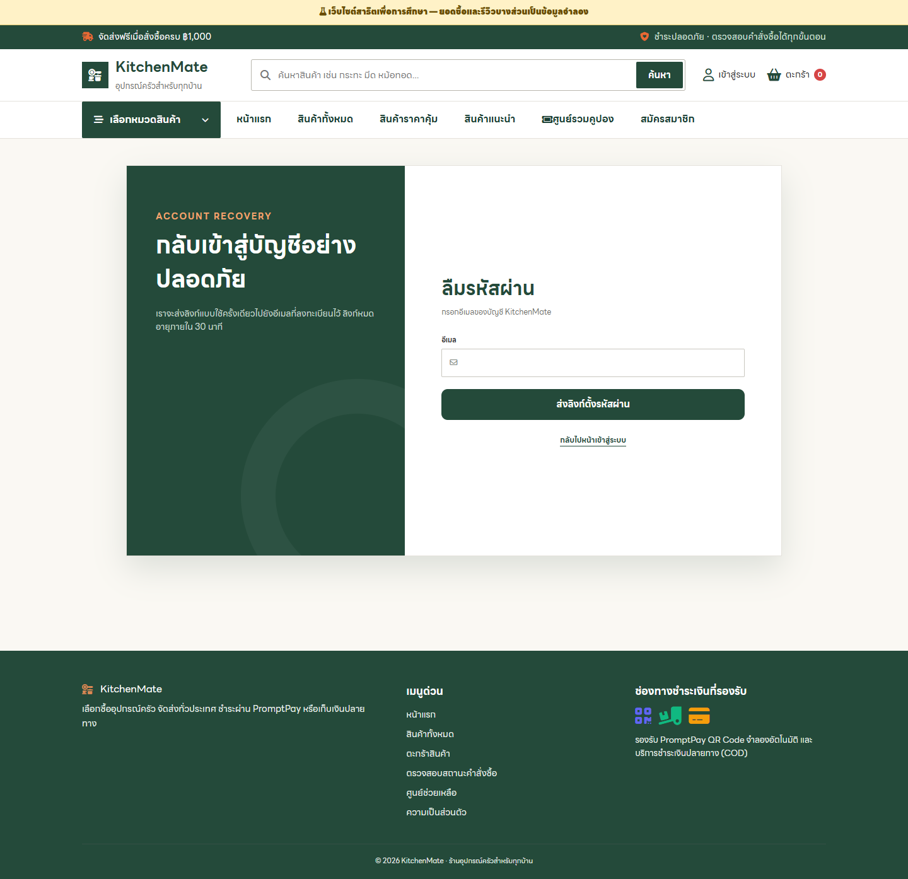

**สิ่งที่แสดง:** แบบฟอร์มขอลิงก์ตั้งรหัสผ่านใหม่

**วิธีใช้งาน:** กรอกอีเมลของบัญชี แล้วตรวจอีเมลเพื่อเปิดลิงก์ตั้งรหัสผ่านใหม่

**ตำแหน่งหน้า:** `forgot-password.php`

## 10. ตรวจสอบอีเมล

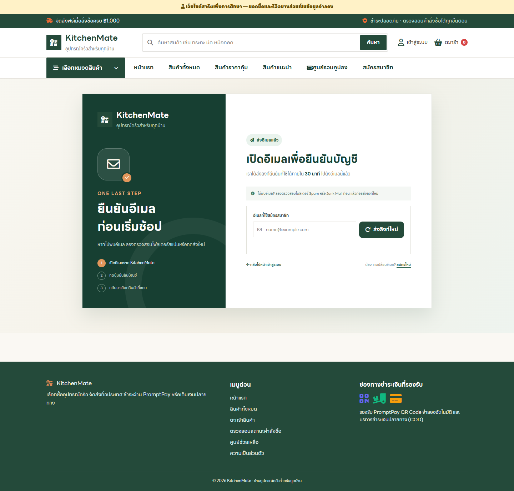

**สิ่งที่แสดง:** คำแนะนำหลังสมัครและปุ่มส่งลิงก์ยืนยันใหม่

**วิธีใช้งาน:** อ่านคำแนะนำ เปิดกล่องอีเมลและกดลิงก์ยืนยัน; หากไม่พบให้ตรวจ Spam/Junk หรือขอส่งใหม่

**ตำแหน่งหน้า:** `check-email.php`

## 11. นโยบายความเป็นส่วนตัว

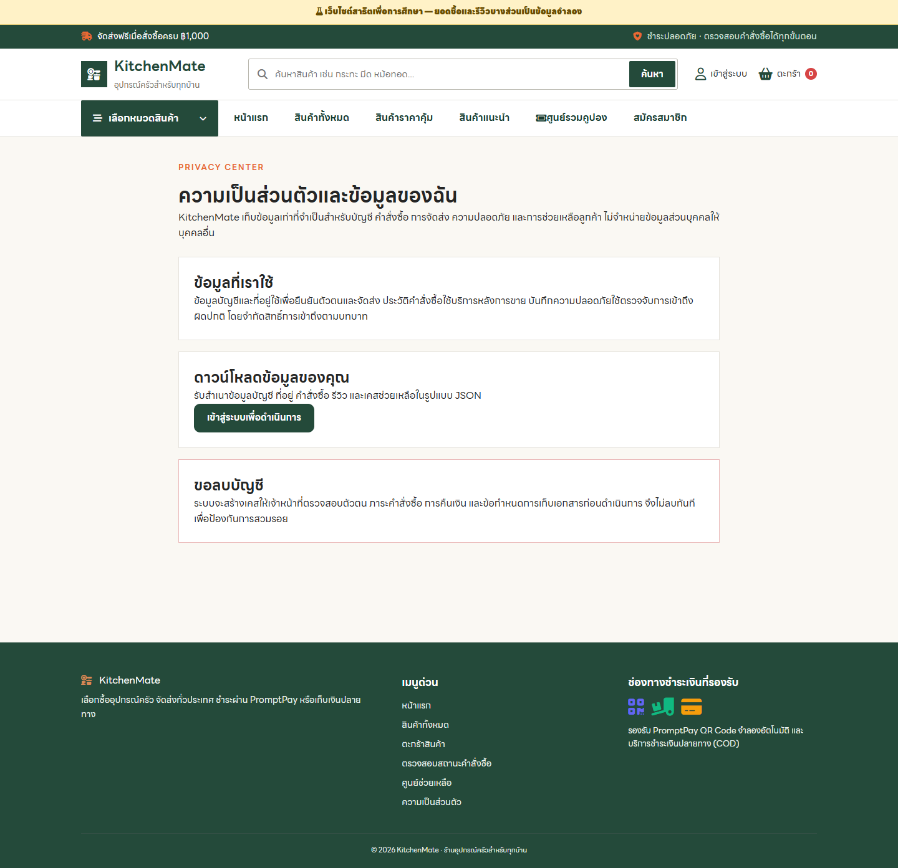

**สิ่งที่แสดง:** ข้อมูลนโยบายและสิทธิ์ข้อมูลส่วนบุคคล

**วิธีใช้งาน:** อ่านรายละเอียดการเก็บ ใช้ และดูแลข้อมูลส่วนบุคคลก่อนสมัครสมาชิก

**ตำแหน่งหน้า:** `privacy.php`
