# 02 บัญชีลูกค้า

ใช้บัญชีลูกค้าเพื่อจัดการข้อมูลส่วนตัว ตะกร้า การชำระเงิน คำสั่งซื้อ และบริการหลังการขาย ภาพตะกร้าและชำระเงินใช้รายการสินค้าในเซสชันสำหรับถ่ายภาพโดยไม่มีการสร้างออเดอร์ใหม่

ภาพในโฟลเดอร์: **15 หน้า**

## 01. โปรไฟล์ลูกค้า

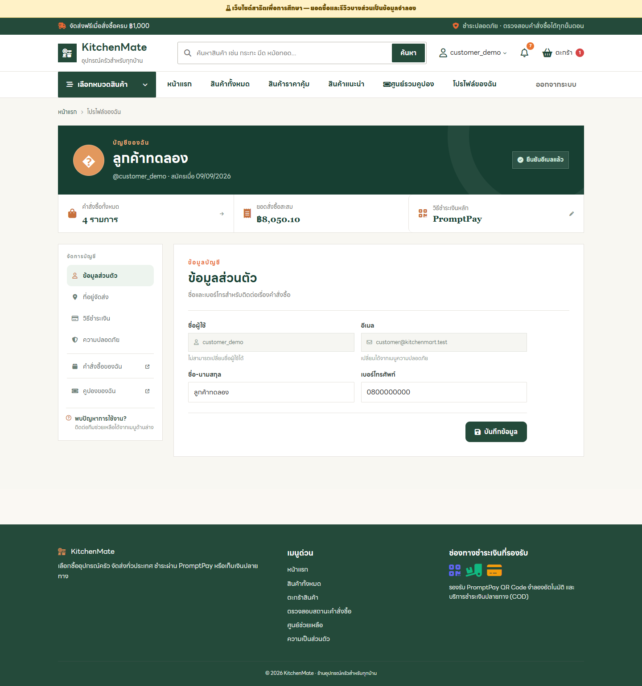

**สิ่งที่แสดง:** ข้อมูลบัญชีและการจัดการข้อมูลส่วนตัว

**วิธีใช้งาน:** ตรวจข้อมูลบัญชี แก้ชื่อ เบอร์โทรหรือข้อมูลที่ระบบอนุญาต แล้วบันทึก

**ตำแหน่งหน้า:** `profile.php`

## 02. สมุดที่อยู่

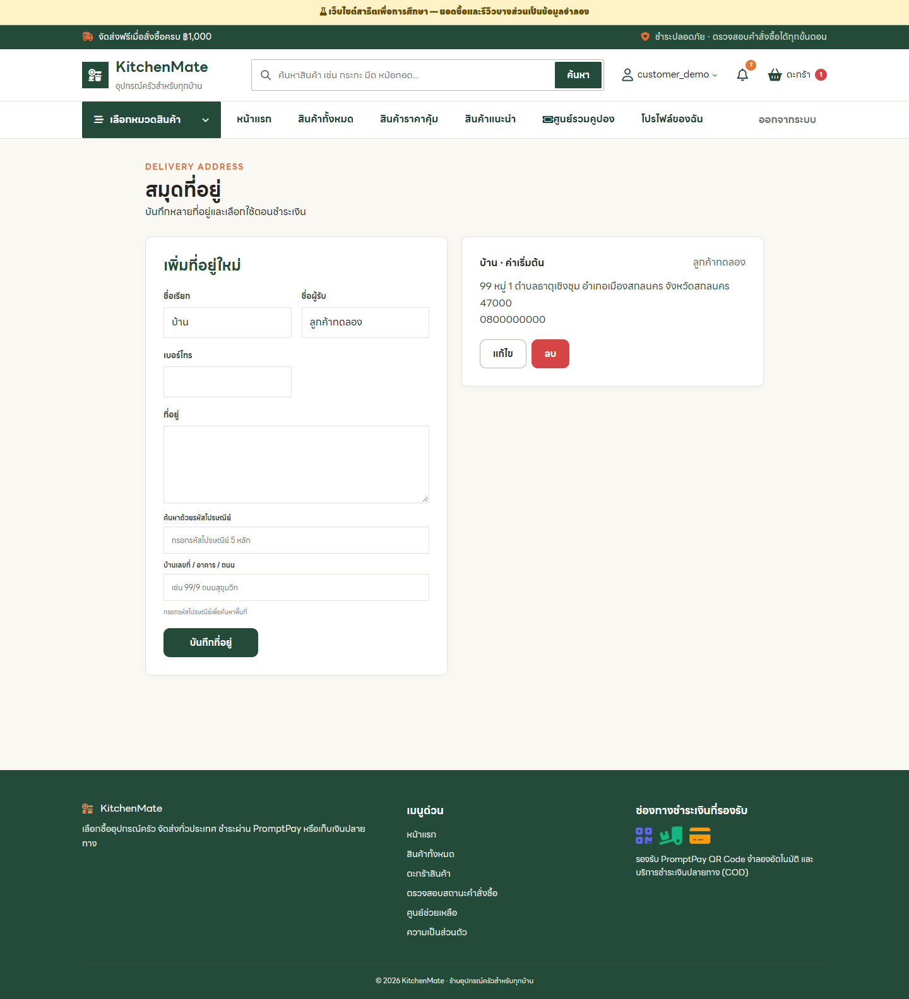

**สิ่งที่แสดง:** ที่อยู่จัดส่งและการเพิ่มหรือแก้ไขที่อยู่

**วิธีใช้งาน:** เพิ่มที่อยู่ใหม่ ตั้งเป็นค่าเริ่มต้น หรือแก้ข้อมูลผู้รับเพื่อใช้ตอนชำระเงิน

**ตำแหน่งหน้า:** `address-book.php`

## 03. รายการโปรด

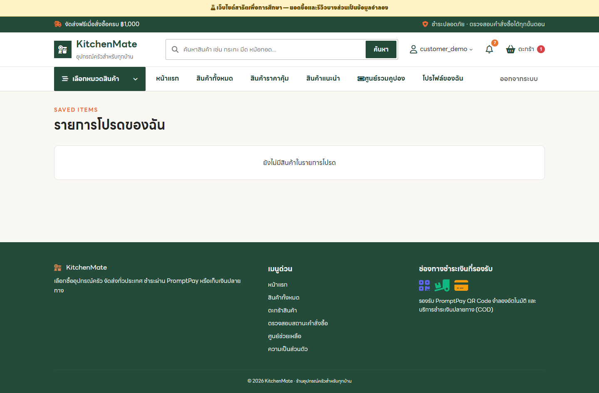

**สิ่งที่แสดง:** สินค้าที่บันทึกไว้สำหรับกลับมาดู

**วิธีใช้งาน:** เปิดสินค้าที่บันทึกไว้ แล้วกลับไปหน้าสินค้าเพื่อสั่งซื้อหรือลบออกจากรายการโปรด

**ตำแหน่งหน้า:** `wishlist.php`

## 04. ตะกร้าสินค้า

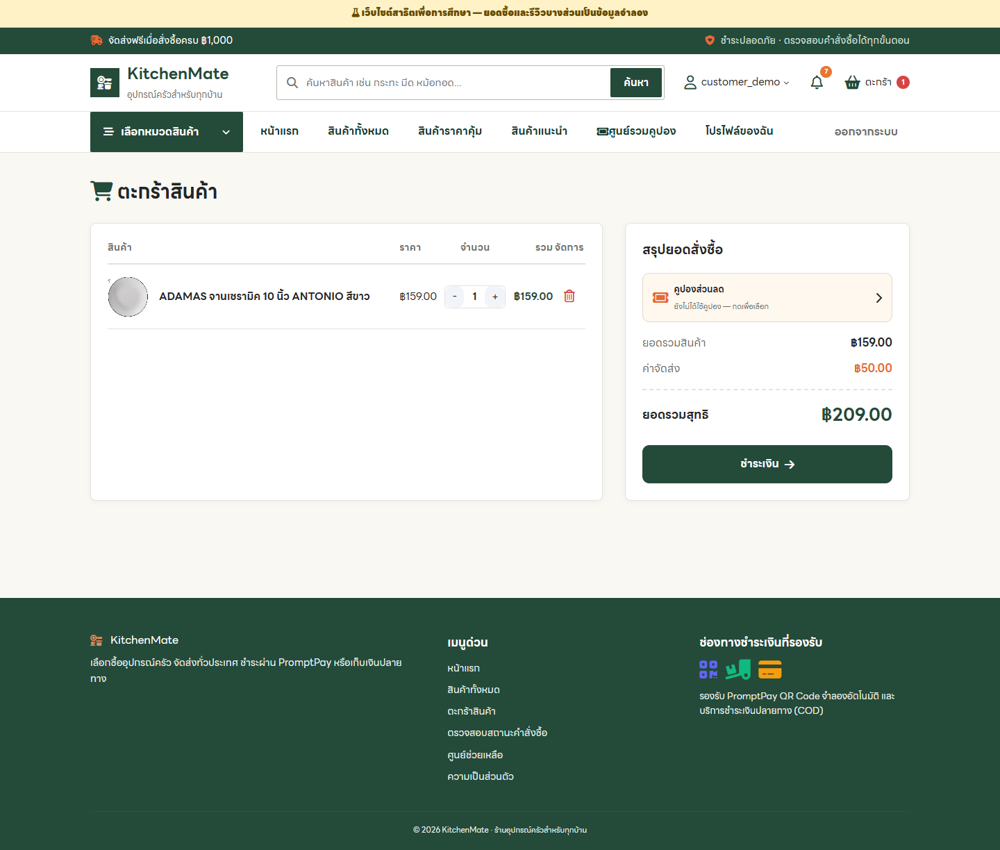

**สิ่งที่แสดง:** รายการในตะกร้า จำนวนสินค้า และยอดรวม

**วิธีใช้งาน:** ตรวจชื่อ ราคาและจำนวนสินค้า ปรับจำนวนหรือลบรายการ แล้วไปหน้าชำระเงิน

**ตำแหน่งหน้า:** `cart.php`

## 05. ชำระเงิน

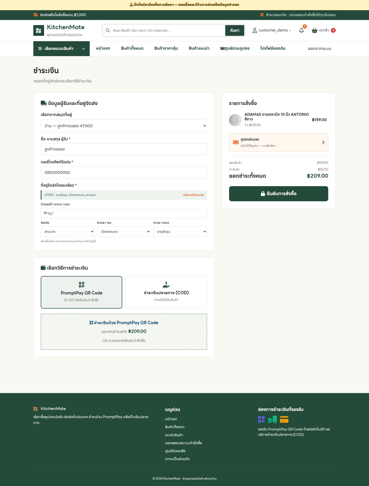

**สิ่งที่แสดง:** ที่อยู่จัดส่ง คูปอง ยอดรวม และวิธีชำระเงิน

**วิธีใช้งาน:** เลือกที่อยู่ ตรวจยอดรวม เปิดเลือกคูปอง เลือก PromptPay หรือ COD แล้วจึงกดยืนยันคำสั่งซื้อ

**ตำแหน่งหน้า:** `checkout.php`

## 06. คูปองของฉัน

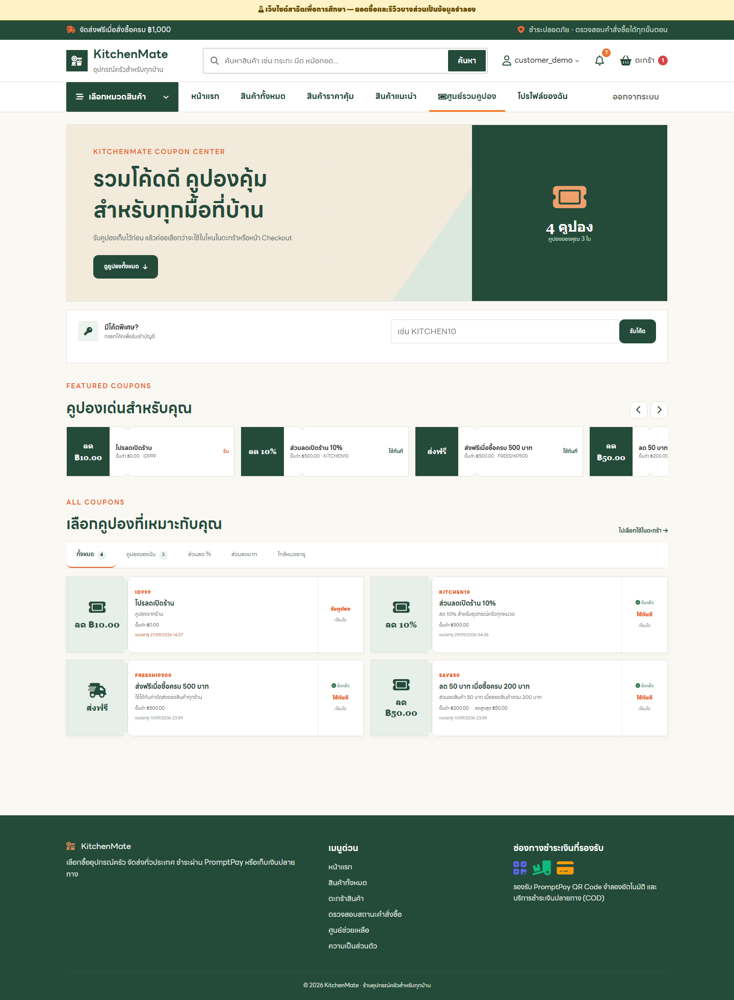

**สิ่งที่แสดง:** คูปองที่รับแล้วและเงื่อนไขการใช้งาน

**วิธีใช้งาน:** ดูคูปองที่มีและเงื่อนไข เช่น ยอดขั้นต่ำหรือวันหมดอายุ แล้วนำไปเลือกในหน้าชำระเงิน

**ตำแหน่งหน้า:** `my-coupons.php`

## 07. คำสั่งซื้อของฉัน

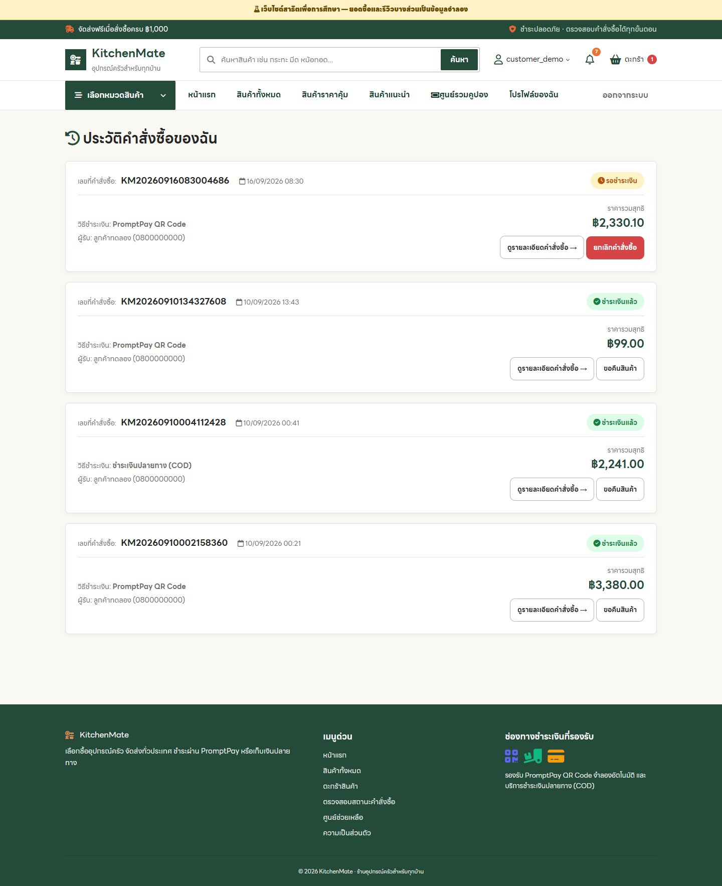

**สิ่งที่แสดง:** ประวัติคำสั่งซื้อและสถานะ

**วิธีใช้งาน:** ตรวจรายการสั่งซื้อทั้งหมด ใช้สถานะและหมายเลขออเดอร์เพื่อเลือกดูรายละเอียด

**ตำแหน่งหน้า:** `my-orders.php`

## 08. รายละเอียดคำสั่งซื้อ

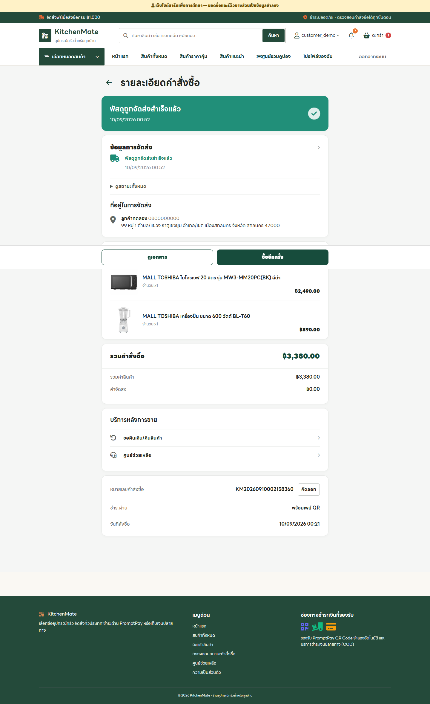

**สิ่งที่แสดง:** รายการสินค้า การชำระเงิน การจัดส่ง และสถานะ

**วิธีใช้งาน:** ตรวจสินค้าที่สั่ง ที่อยู่ วิธีจ่าย และลำดับสถานะ; ใช้ปุ่มบริการหลังการขายเมื่อเข้าเงื่อนไข

**ตำแหน่งหน้า:** `order-detail.php?id=24`

## 09. หน้าสั่งซื้อสำเร็จ

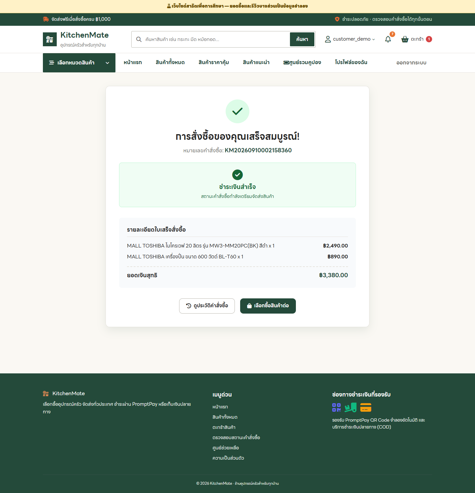

**สิ่งที่แสดง:** สรุปคำสั่งซื้อที่มีอยู่ของบัญชีหลังยืนยันรายการ

**วิธีใช้งาน:** ดูหมายเลขและยอดของออเดอร์ที่มีอยู่ จากนั้นไปดูรายละเอียดหรือติดตามคำสั่งซื้อ

**ตำแหน่งหน้า:** `order-success.php?order_id=24`

## 10. ใบเสร็จ

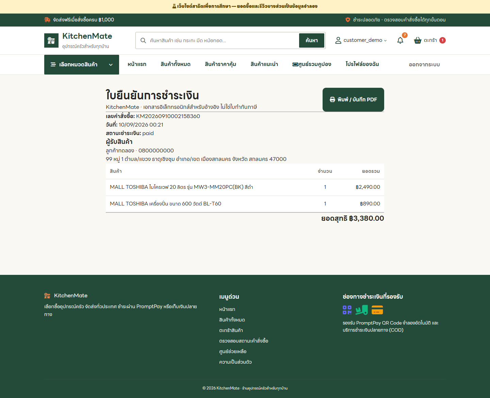

**สิ่งที่แสดง:** เอกสารคำสั่งซื้อสำหรับออเดอร์ที่เลือก

**วิธีใช้งาน:** เปิดข้อมูลการซื้อของออเดอร์นั้น และใช้คำสั่งพิมพ์/บันทึกจากเบราว์เซอร์เมื่อจำเป็น

**ตำแหน่งหน้า:** `receipt.php?id=24`

## 11. คำขอคืนสินค้า

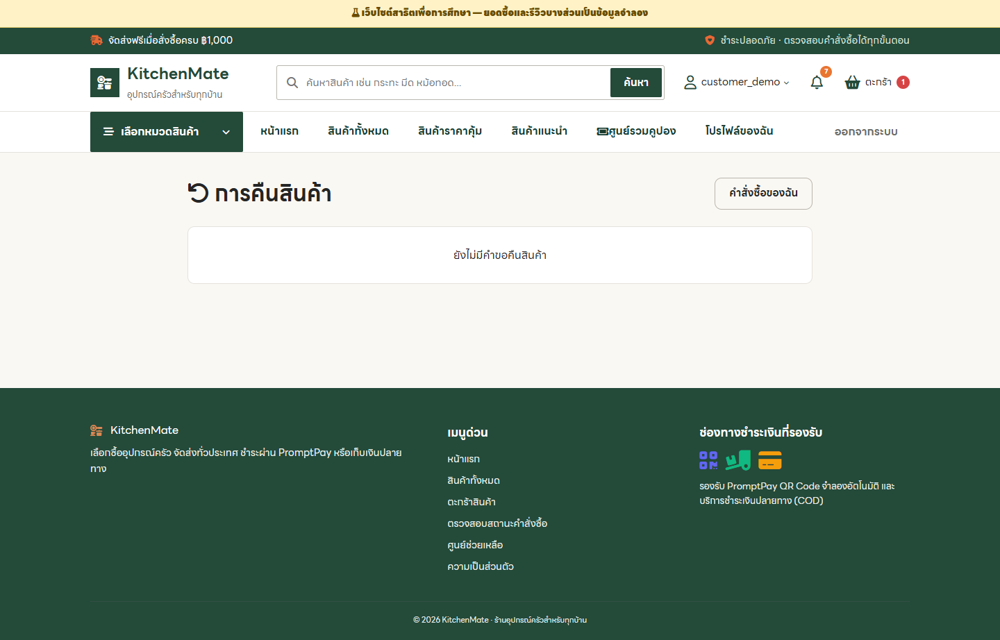

**สิ่งที่แสดง:** ติดตามคำขอคืนและการคืนเงิน

**วิธีใช้งาน:** ดูคำขอคืนสินค้าที่ส่งไว้และสถานะการพิจารณา

**ตำแหน่งหน้า:** `my-returns.php`

## 12. ยื่นคำขอคืนสินค้า

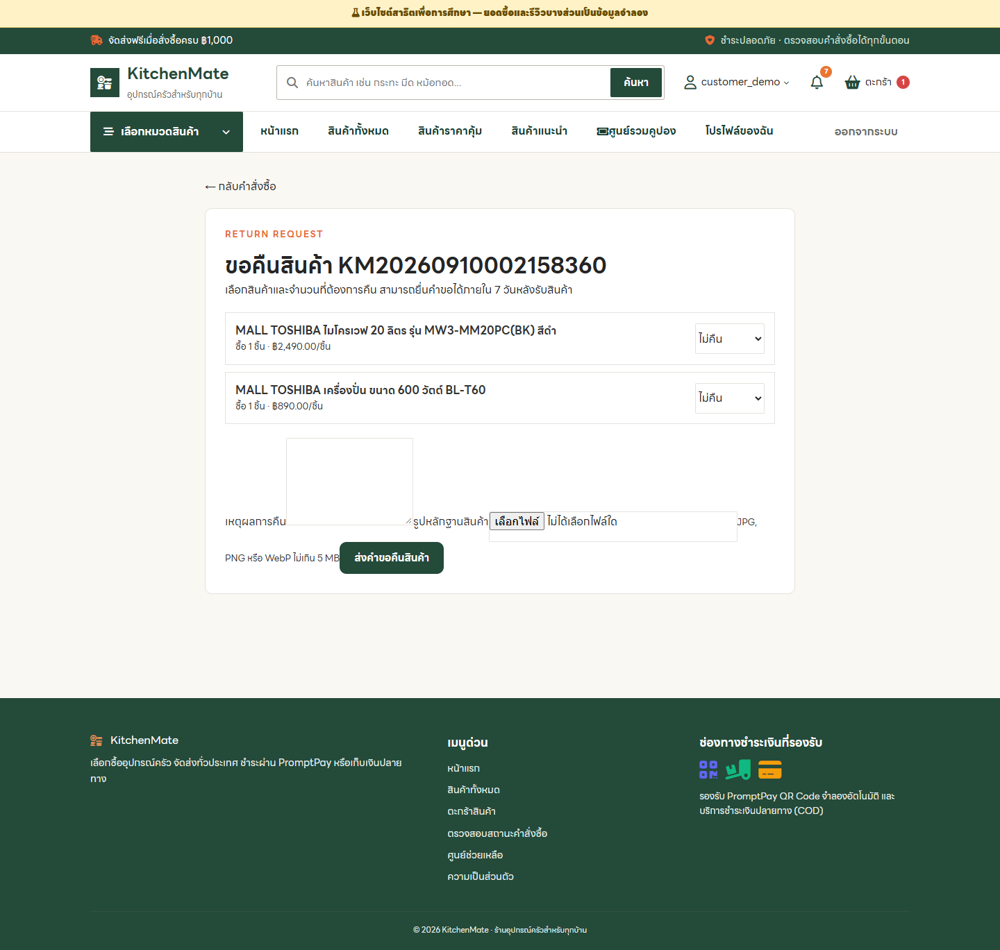

**สิ่งที่แสดง:** แบบฟอร์มระบุรายการและเหตุผลการคืน

**วิธีใช้งาน:** เลือกสินค้าที่ต้องการคืน ระบุเหตุผลและรายละเอียด แล้วตรวจข้อมูลก่อนส่งคำขอ

**ตำแหน่งหน้า:** `return-request.php?order_id=24`

## 13. การแจ้งเตือน

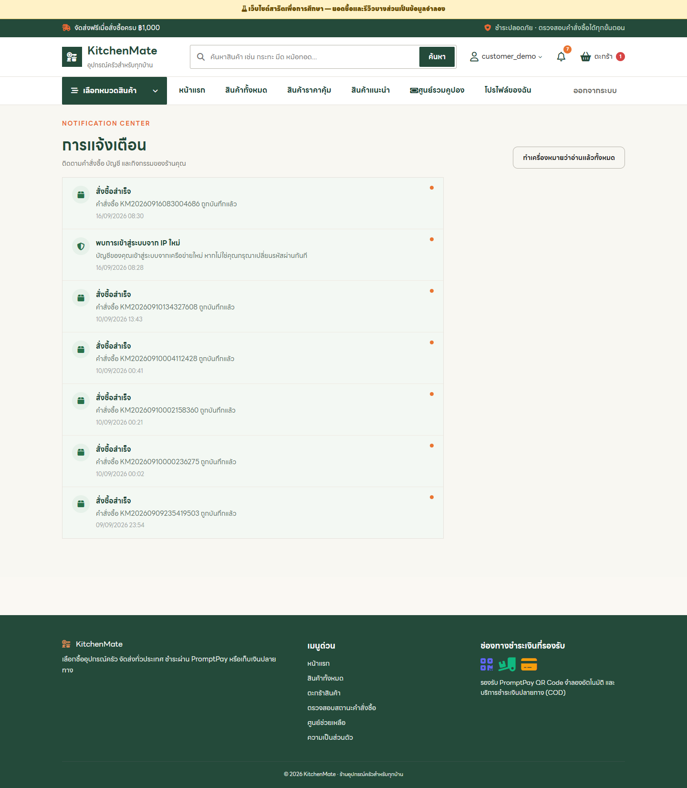

**สิ่งที่แสดง:** รายการแจ้งเตือนของบัญชี

**วิธีใช้งาน:** อ่านรายการแจ้งเตือนล่าสุด แล้วเปิดลิงก์ที่เกี่ยวข้องกับออเดอร์ ร้านค้า หรือบัญชี

**ตำแหน่งหน้า:** `notifications.php`

## 14. ข้อความ

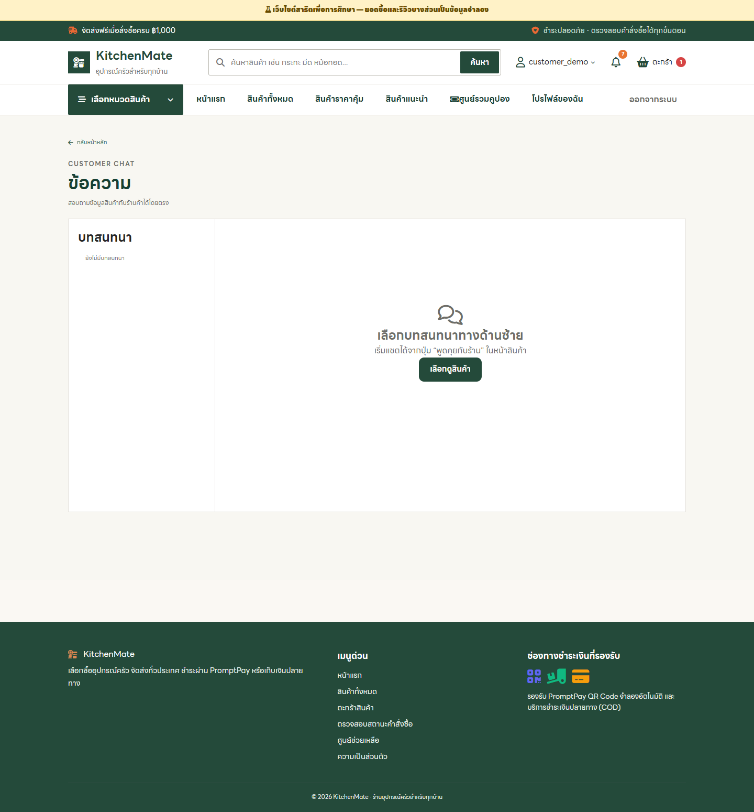

**สิ่งที่แสดง:** การสนทนากับร้านค้า

**วิธีใช้งาน:** เลือกคู่สนทนาหรือร้านค้า อ่านประวัติ และส่งข้อความสอบถามสินค้า/คำสั่งซื้อ

**ตำแหน่งหน้า:** `messages.php`

## 15. ศูนย์ช่วยเหลือ

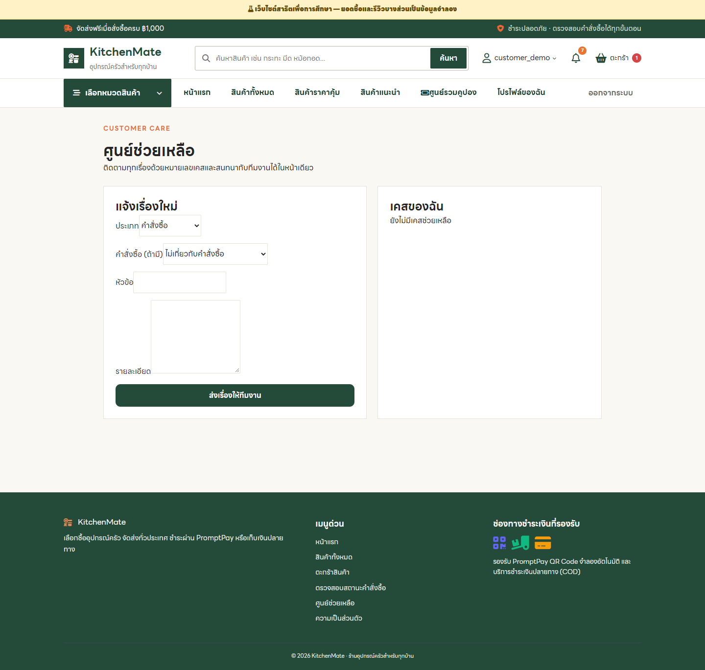

**สิ่งที่แสดง:** การส่งคำถามหรือปัญหาให้ทีมดูแล

**วิธีใช้งาน:** เปิดศูนย์ช่วยเหลือ ระบุหัวข้อและรายละเอียดปัญหา แล้วติดตามคำตอบในระบบ

**ตำแหน่งหน้า:** `support.php`
