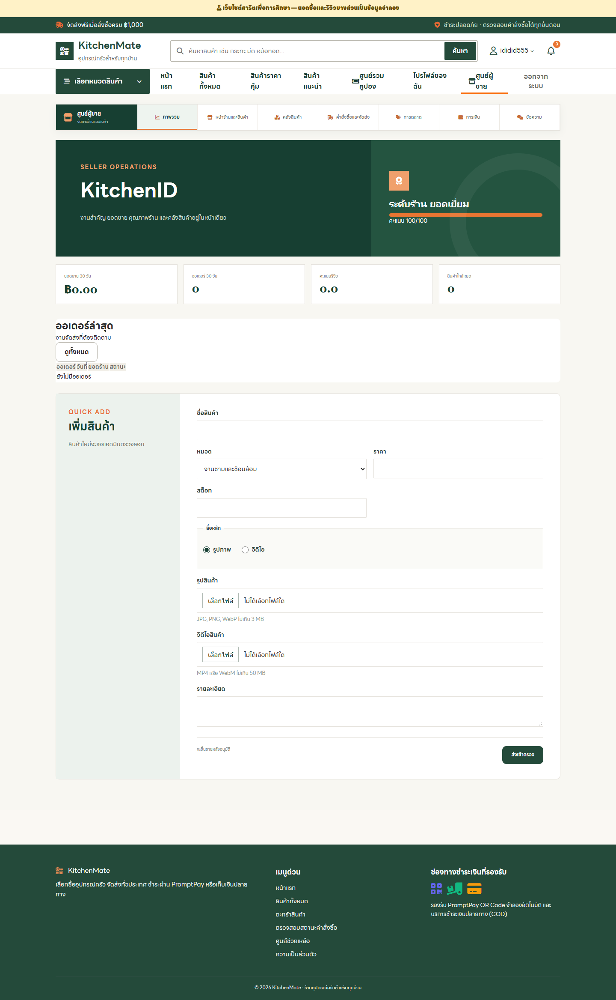
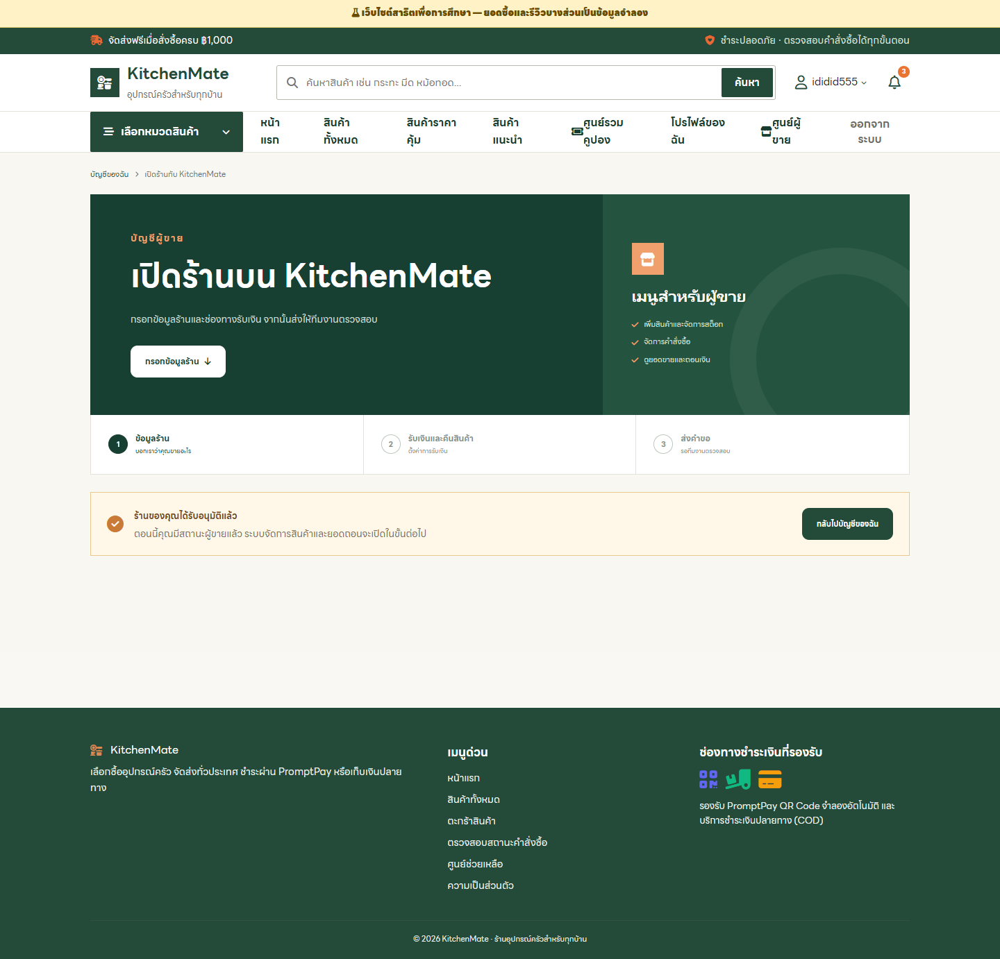
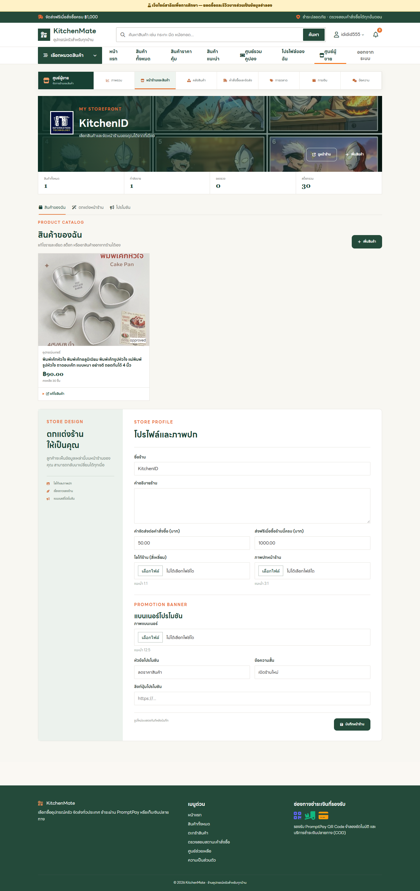
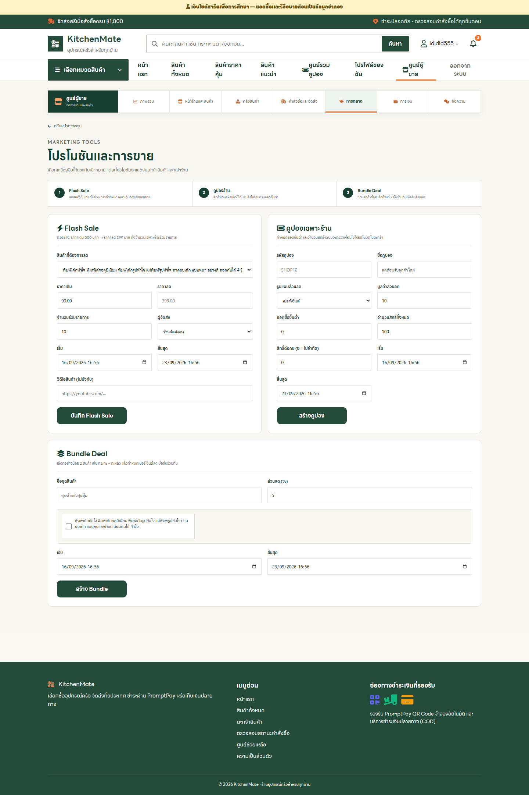
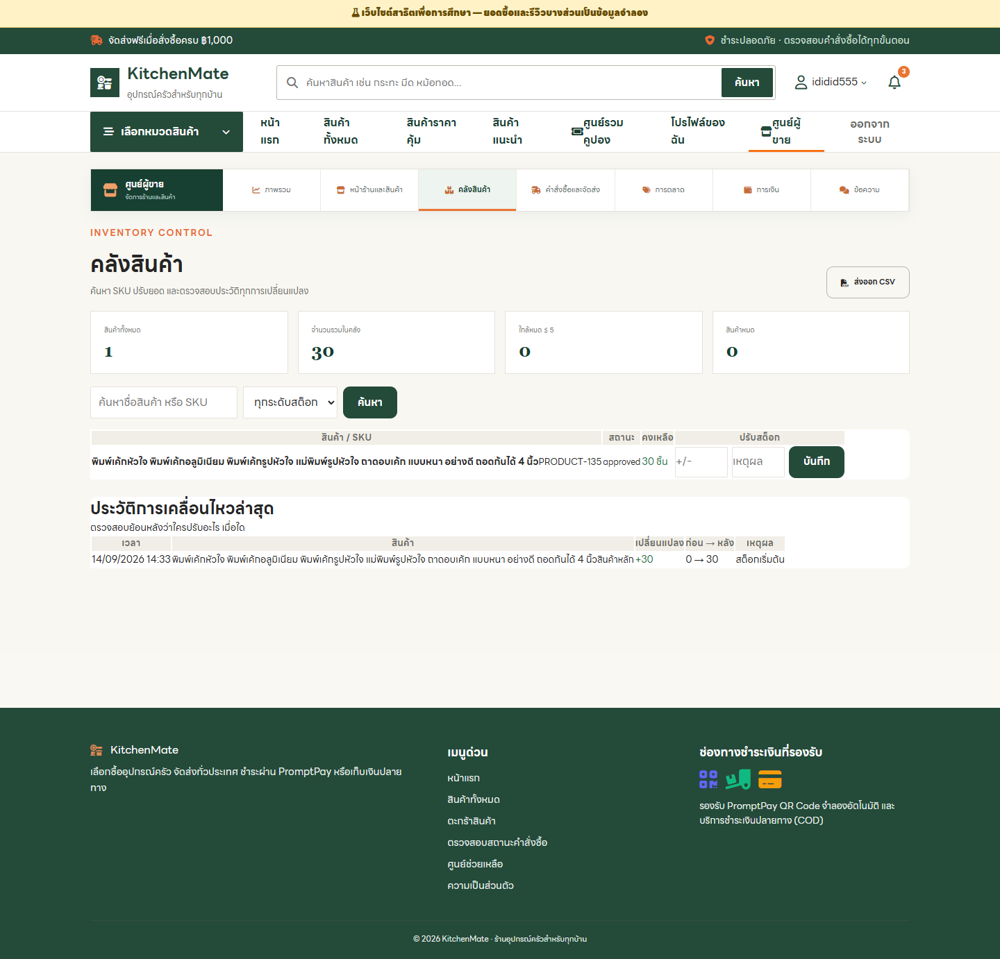
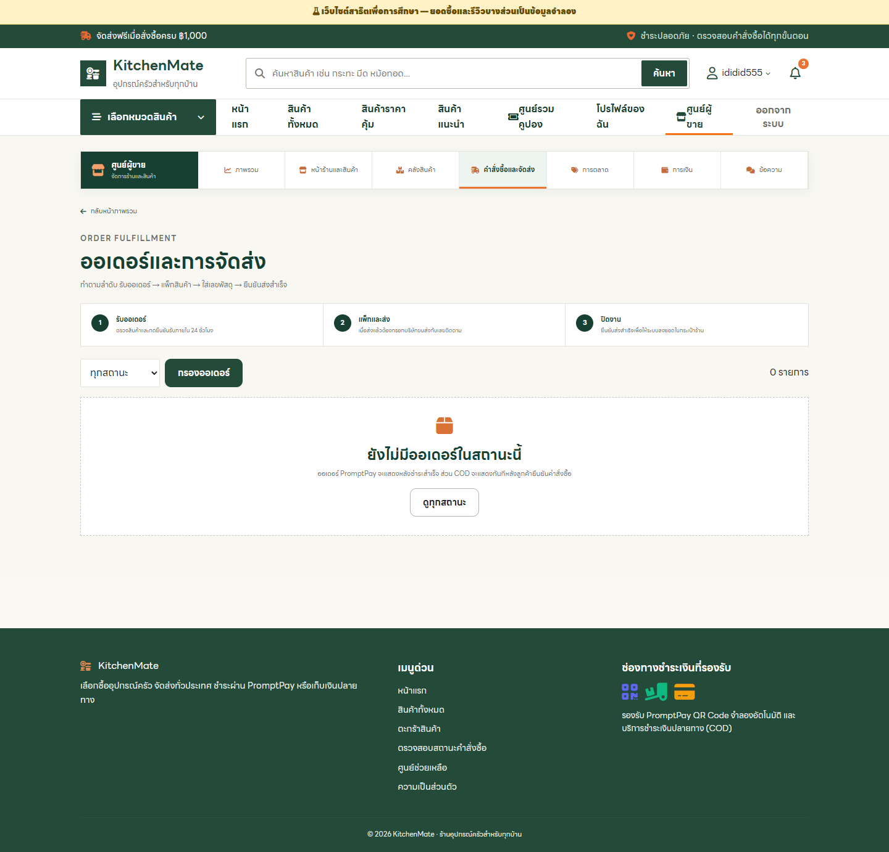
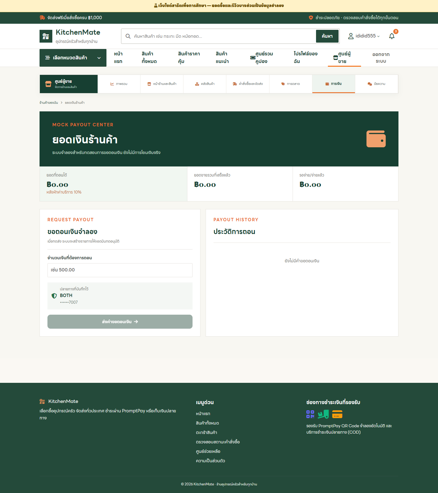
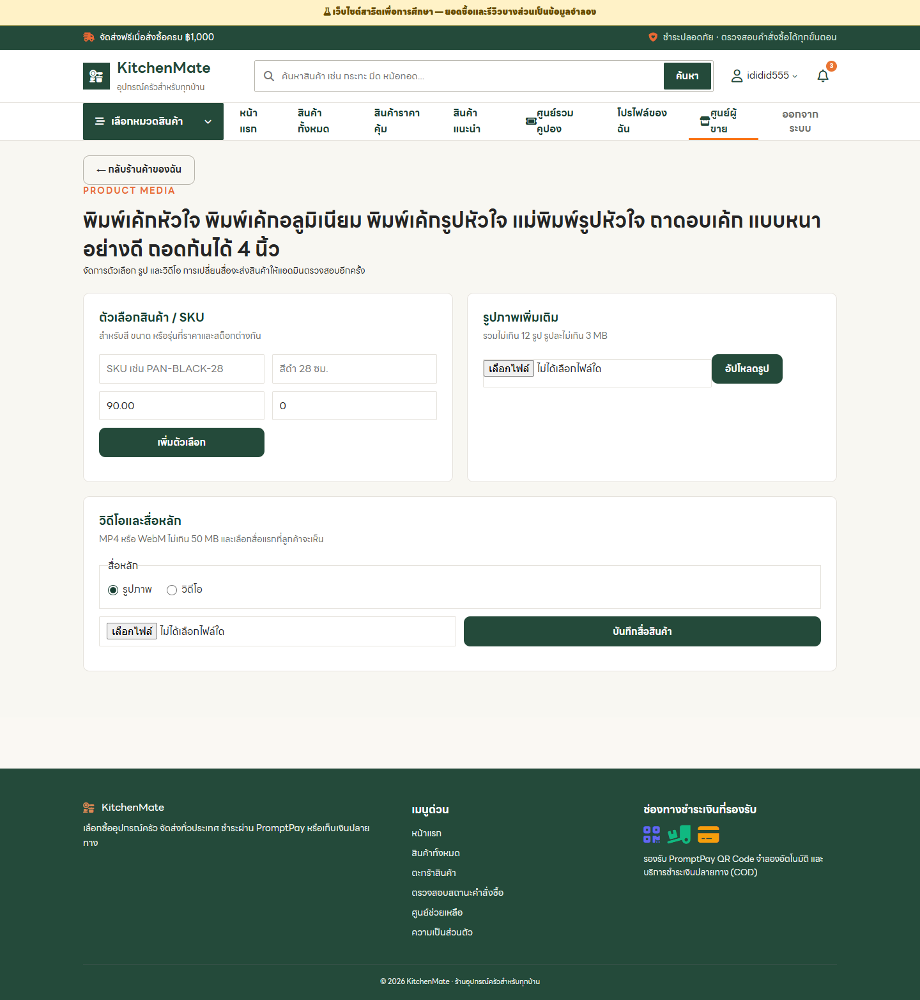

# 03 ระบบผู้ขาย

ใช้บัญชีผู้ขายที่มีร้านได้รับอนุมัติแล้ว เพื่อแสดงหน้าจัดการร้าน สินค้า สต็อก ออเดอร์ และการเงิน

ภาพในโฟลเดอร์: **8 หน้า**

## 01. แดชบอร์ดผู้ขาย

**สิ่งที่แสดง:** ภาพรวมยอดขาย งานค้าง และทางลัดเพิ่มสินค้า

**วิธีใช้งาน:** เริ่มที่ตัวเลขสรุปและงานล่าสุด จากนั้นใช้เมนูด้านบนไปสินค้า คลัง ออเดอร์ หรือการเงิน

**ตำแหน่งหน้า:** `seller-dashboard.php`

## 02. ตั้งค่าร้าน

**สิ่งที่แสดง:** ข้อมูลร้านและสถานะบัญชีผู้ขาย

**วิธีใช้งาน:** ตรวจสถานะร้านและข้อมูลพื้นฐานก่อนตั้งค่าหน้าร้านหรือเพิ่มสินค้า

**ตำแหน่งหน้า:** `seller.php`

## 03. ร้านค้าของฉัน

**สิ่งที่แสดง:** ข้อมูลหน้าร้าน แบนเนอร์ โปรโมชัน และการจัดการร้าน

**วิธีใช้งาน:** แก้ชื่อร้าน คำอธิบาย รูปและแบนเนอร์ ตรวจข้อมูลก่อนบันทึกหน้าร้าน

**ตำแหน่งหน้า:** `my-store.php`

## 04. จัดการสินค้าผู้ขาย

**สิ่งที่แสดง:** รายการสินค้าที่ลงขายและสถานะการอนุมัติ

**วิธีใช้งาน:** ดูสินค้าของร้านและสถานะอนุมัติ เปิดแก้รายละเอียดหรือส่งสินค้าใหม่เข้าตรวจ

**ตำแหน่งหน้า:** `seller-marketplace.php`

## 05. สต็อกสินค้า

**สิ่งที่แสดง:** จำนวนคงเหลือและการปรับสต็อก

**วิธีใช้งาน:** ตรวจจำนวนคงเหลือ กรองสินค้าใกล้หมด และบันทึกการปรับสต็อก

**ตำแหน่งหน้า:** `seller-inventory.php`

## 06. คำสั่งซื้อของร้าน

**สิ่งที่แสดง:** ออเดอร์ที่ต้องดำเนินการและสถานะการจัดส่ง

**วิธีใช้งาน:** เปิดออเดอร์ของร้าน ดำเนินการตามลำดับรับงาน แพ็ก ส่ง และระบุเลขพัสดุเมื่อจัดส่ง

**ตำแหน่งหน้า:** `seller-orders.php`

## 07. กระเป๋าเงินผู้ขาย

**สิ่งที่แสดง:** ยอดเงิน รายการรับเงิน และการถอนเงิน

**วิธีใช้งาน:** ตรวจยอดเงินและรายการเคลื่อนไหว เปิดคำขอถอนเงินเมื่อยอดพร้อมถอน

**ตำแหน่งหน้า:** `seller-wallet.php`

## 08. ตัวเลือกสินค้า

**สิ่งที่แสดง:** ตัวเลือกหรือรุ่นย่อยของสินค้าที่เลือก

**วิธีใช้งาน:** เพิ่มหรือแก้ตัวเลือกสินค้า รูปในแกลเลอรี และวิดีโอ แล้วบันทึกสื่อหลัก

**ตำแหน่งหน้า:** `seller-product-options.php?id=135`
