# 04 ระบบแอดมิน

ใช้เซสชันภายในเครื่องสำหรับภาพระบบหลังบ้าน ครอบคลุมหน้าภาพรวม การขาย ร้านค้า การเงิน การช่วยเหลือ และความปลอดภัย

ภาพในโฟลเดอร์: **18 หน้า**

## 01. แดชบอร์ดแอดมิน

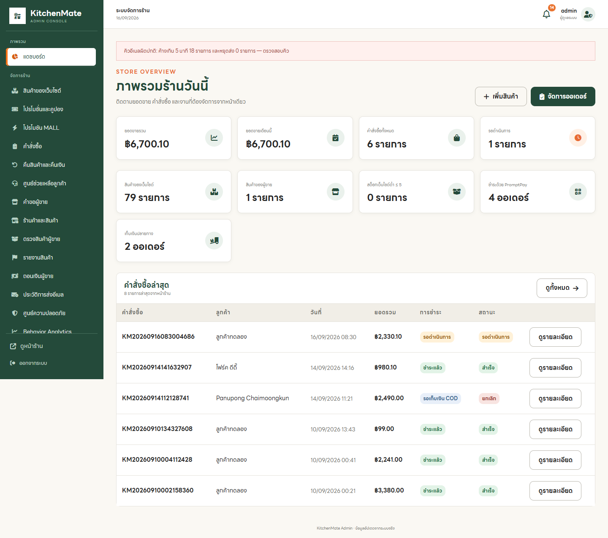

**สิ่งที่แสดง:** ตัวเลขภาพรวมและงานที่ต้องติดตาม

**วิธีใช้งาน:** ดูยอดขาย จำนวนออเดอร์ งานรอดำเนินการ และใช้ทางลัดไปหน้าที่ต้องจัดการ

**ตำแหน่งหน้า:** `admin/index.php`

## 02. สินค้าของเว็บไซต์

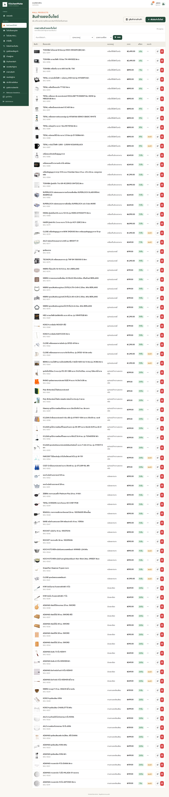

**สิ่งที่แสดง:** เพิ่ม แก้ไข และตรวจรายการสินค้าหลัก

**วิธีใช้งาน:** ค้นหาสินค้า เพิ่มหรือแก้ข้อมูล ราคา รูป หมวด และสถานะการเผยแพร่

**ตำแหน่งหน้า:** `admin/products.php`

## 03. โปรโมชันและคูปอง

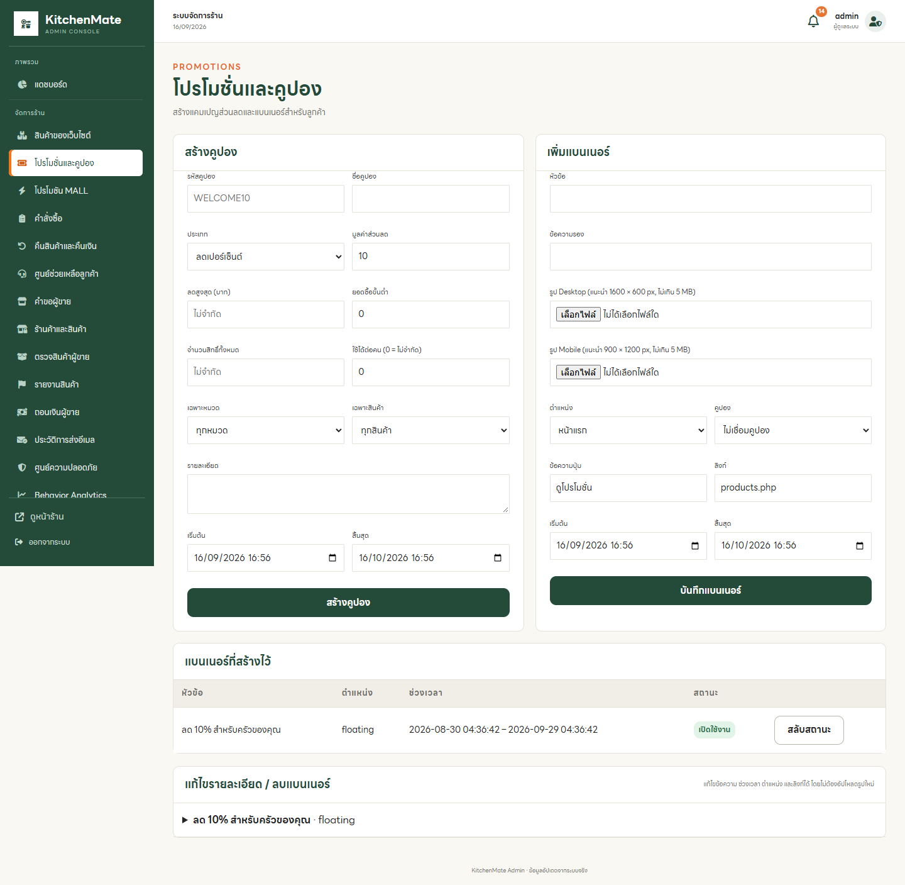

**สิ่งที่แสดง:** แคมเปญส่วนลดและคูปอง

**วิธีใช้งาน:** สร้างหรือแก้คูปอง/โปรโมชัน ตั้งสิทธิ์และช่วงเวลา แล้วตรวจสถานะใช้งาน

**ตำแหน่งหน้า:** `admin/promotions.php`

## 04. โปรโมชัน MALL

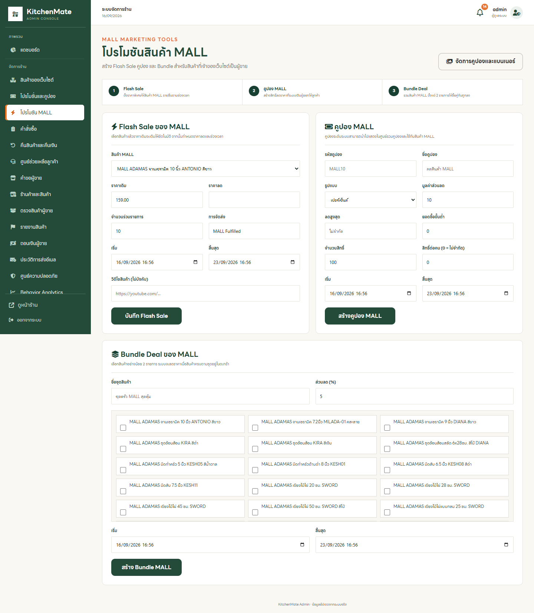

**สิ่งที่แสดง:** กิจกรรมส่งเสริมการขายระดับเว็บไซต์

**วิธีใช้งาน:** จัดการแคมเปญระดับ MALL และการนำเสนอโปรโมชันบนเว็บไซต์

**ตำแหน่งหน้า:** `admin/mall-promotions.php`

## 05. คำสั่งซื้อ

**สิ่งที่แสดง:** รายการออเดอร์ทั้งหมดและตัวกรองสถานะ

**วิธีใช้งาน:** กรองออเดอร์ตามสถานะ เปิดรายละเอียด และติดตามขั้นตอนชำระ/จัดส่ง

**ตำแหน่งหน้า:** `admin/orders.php`

## 06. รายละเอียดออเดอร์

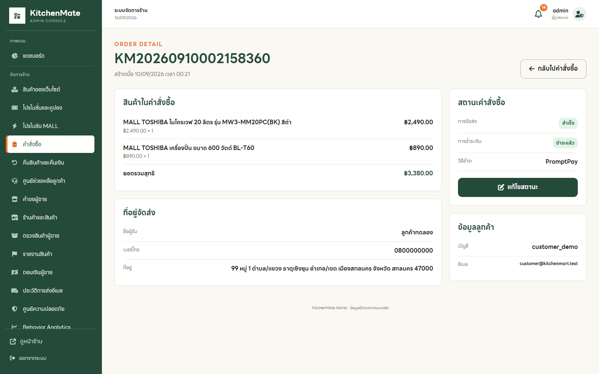

**สิ่งที่แสดง:** ข้อมูลออเดอร์ การชำระเงิน และการจัดส่ง

**วิธีใช้งาน:** ตรวจรายการสินค้า ผู้รับ การชำระ และประวัติสถานะ ก่อนดำเนินการต่อ

**ตำแหน่งหน้า:** `admin/order-detail.php?id=24`

## 07. คืนสินค้าและคืนเงิน

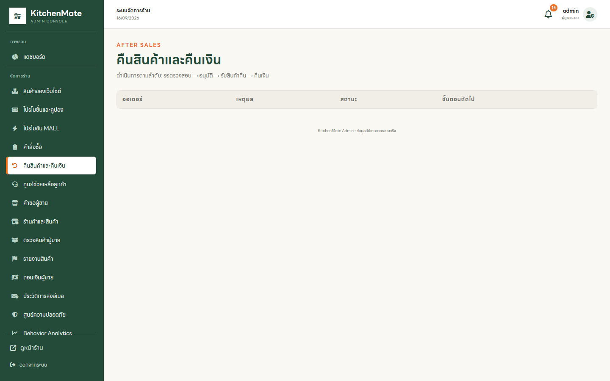

**สิ่งที่แสดง:** รายการคำขอและสถานะการดำเนินการ

**วิธีใช้งาน:** เปิดคำขอคืนสินค้า ตรวจเหตุผลและหลักฐาน แล้วอัปเดตผลการพิจารณา

**ตำแหน่งหน้า:** `admin/returns.php`

## 08. ศูนย์ช่วยเหลือลูกค้า

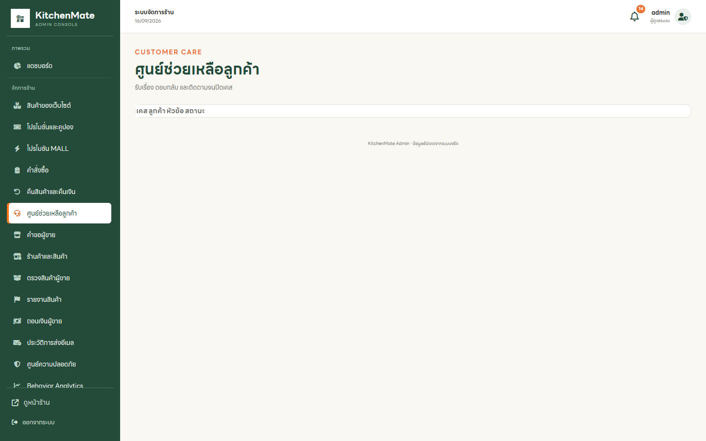

**สิ่งที่แสดง:** เคสช่วยเหลือและข้อความจากลูกค้า

**วิธีใช้งาน:** เปิดเคสลูกค้า อ่านข้อความและตอบกลับตามข้อมูลคำสั่งซื้อหรือบัญชี

**ตำแหน่งหน้า:** `admin/support.php`

## 09. คำขอผู้ขาย

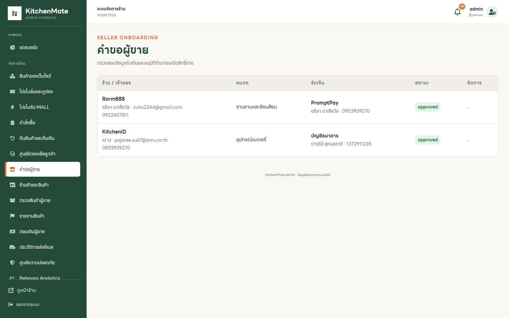

**สิ่งที่แสดง:** คำขอสมัครและการอนุมัติผู้ขาย

**วิธีใช้งาน:** ตรวจข้อมูลคำขอผู้ขายและตัดสินใจอนุมัติหรือดำเนินการตามสถานะ

**ตำแหน่งหน้า:** `admin/sellers.php`

## 10. ร้านค้าและสินค้า

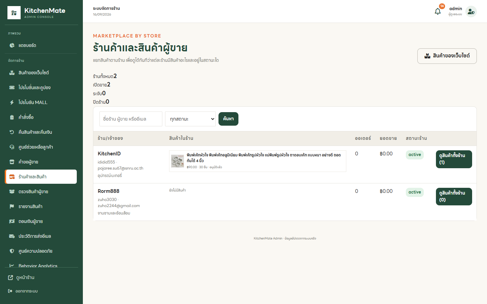

**สิ่งที่แสดง:** รายการร้านและสถานะร้านค้า

**วิธีใช้งาน:** ดูร้านทั้งหมด ค้นหาหรือเปิดรายละเอียดร้านเพื่อดูสถานะและสินค้า

**ตำแหน่งหน้า:** `admin/stores.php`

## 11. รายละเอียดร้าน

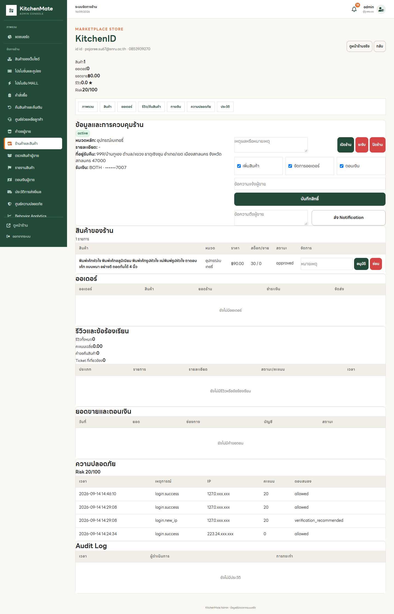

**สิ่งที่แสดง:** ข้อมูลร้านและรายการสินค้าที่เกี่ยวข้อง

**วิธีใช้งาน:** ตรวจข้อมูลร้าน สินค้า และข้อจำกัดที่ใช้กับร้านนั้น

**ตำแหน่งหน้า:** `admin/store-detail.php?id=222`

## 12. ตรวจสินค้าผู้ขาย

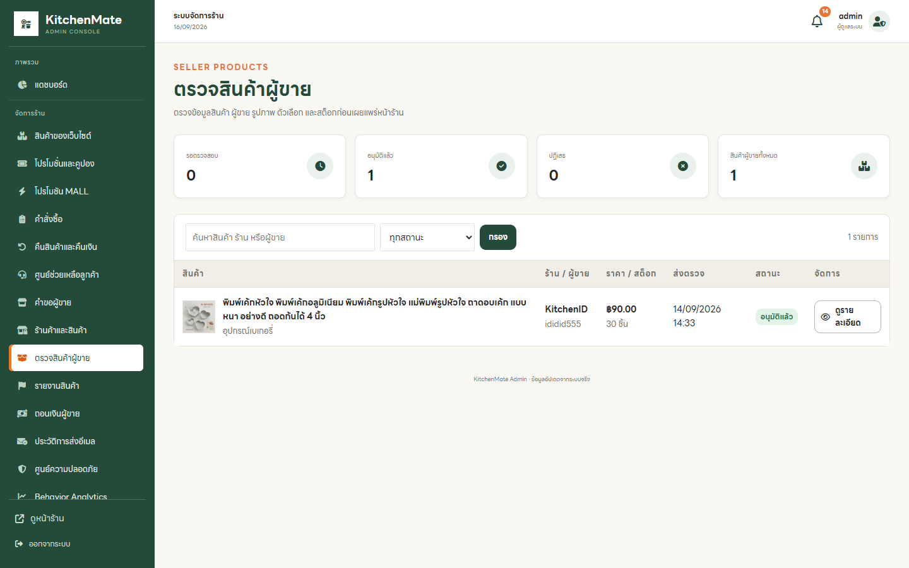

**สิ่งที่แสดง:** สินค้ารออนุมัติและการตรวจสอบ

**วิธีใช้งาน:** ตรวจสินค้าที่ผู้ขายส่งมา และอนุมัติ/ดำเนินการตามผลตรวจ

**ตำแหน่งหน้า:** `admin/seller-products.php`

## 13. รายงานสินค้า

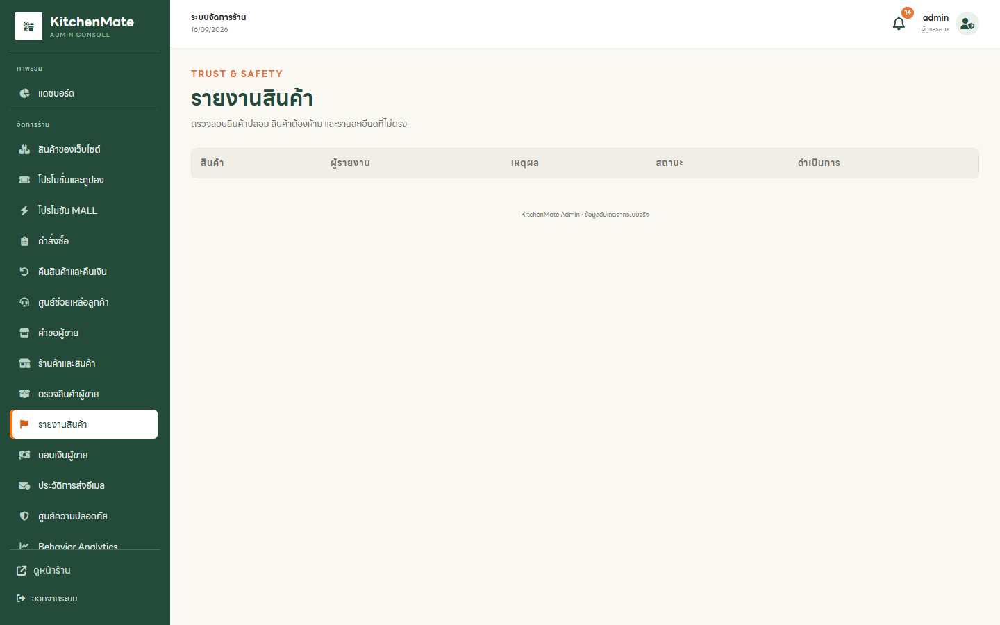

**สิ่งที่แสดง:** รายการสินค้าที่ถูกแจ้งรายงาน

**วิธีใช้งาน:** อ่านเหตุผลการรายงานสินค้า ตรวจรายการที่เกี่ยวข้อง แล้วบันทึกการดำเนินการ

**ตำแหน่งหน้า:** `admin/product-reports.php`

## 14. ถอนเงินผู้ขาย

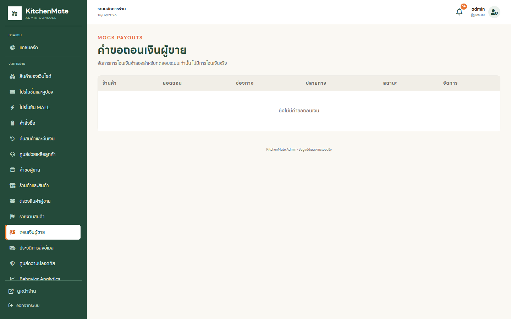

**สิ่งที่แสดง:** คำขอถอนและสถานะการจ่ายเงิน

**วิธีใช้งาน:** ตรวจคำขอถอนเงินผู้ขาย ยอด และสถานะการจ่าย ก่อนบันทึกผล

**ตำแหน่งหน้า:** `admin/payouts.php`

## 15. ประวัติอีเมล

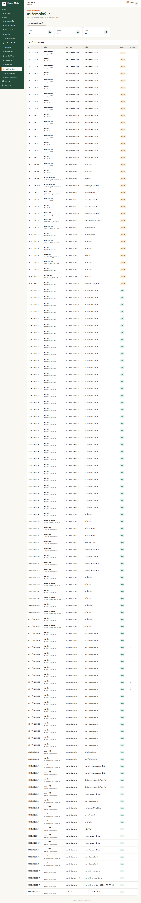

**สิ่งที่แสดง:** สถานะการส่งอีเมลธุรกรรม

**วิธีใช้งาน:** ตรวจอีเมลที่ส่ง/ค้าง/ล้มเหลวเพื่อวิเคราะห์ปัญหาการแจ้งเตือน

**ตำแหน่งหน้า:** `admin/email-logs.php`

## 16. ศูนย์ความปลอดภัย

**สิ่งที่แสดง:** เหตุการณ์และกฎความปลอดภัย

**วิธีใช้งาน:** ดูเหตุการณ์ความปลอดภัย กฎ และข้อมูลที่ระบบใช้เฝ้าระวัง

**ตำแหน่งหน้า:** `admin/security-center.php`

## 17. Behavior Analytics

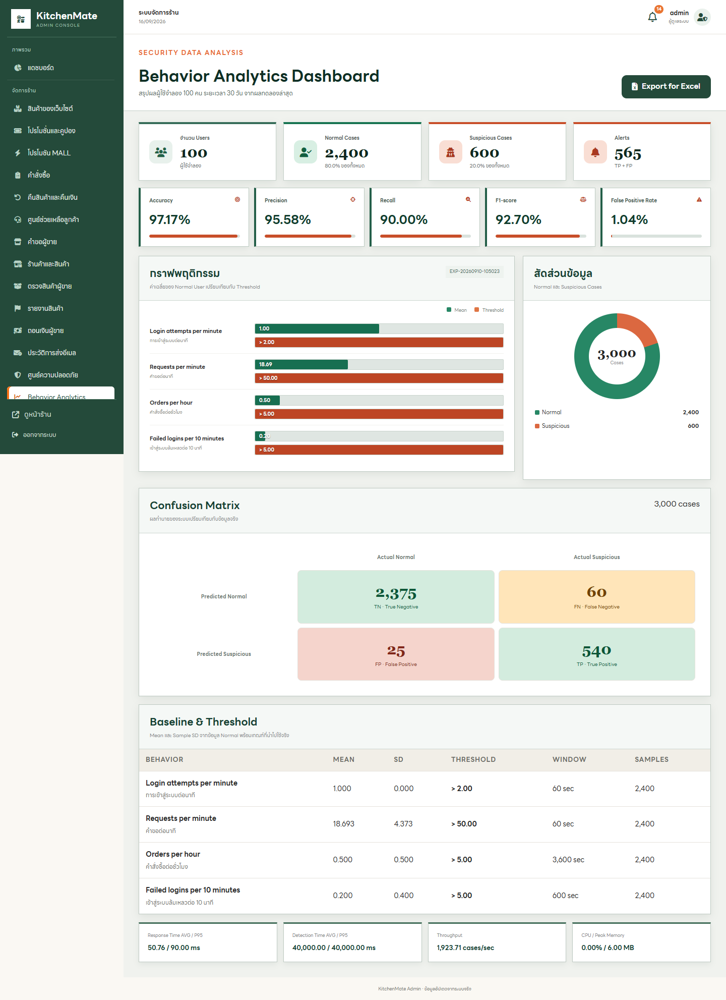

**สิ่งที่แสดง:** ข้อมูลพฤติกรรมการใช้งาน

**วิธีใช้งาน:** อ่านแนวโน้มการใช้งานและพฤติกรรมเพื่อปรับปรุงหน้าเว็บ

**ตำแหน่งหน้า:** `admin/behavior-analytics.php`

## 18. ผู้ใช้งานทั้งหมด

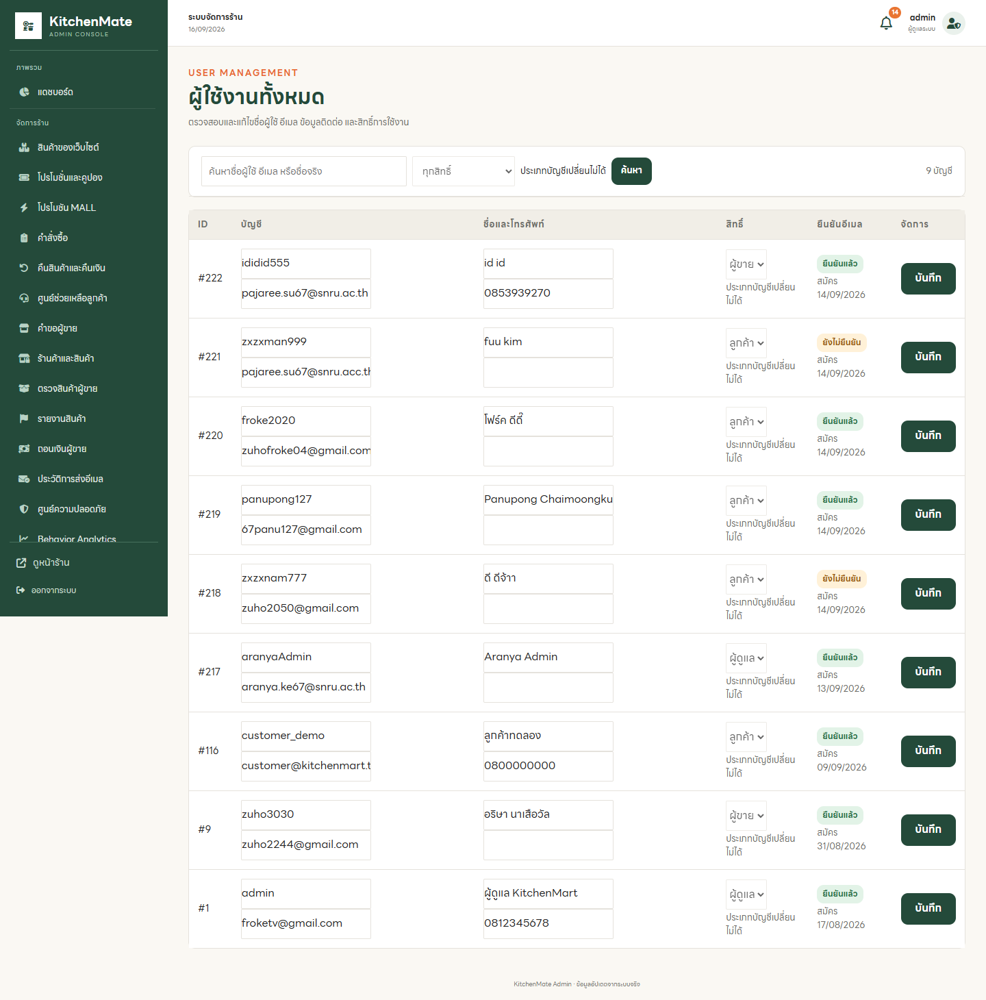

**สิ่งที่แสดง:** รายการผู้ใช้และบทบาท

**วิธีใช้งาน:** ค้นหาบัญชีผู้ใช้ ดูบทบาทและข้อมูลที่จำเป็นต่อการดูแลระบบ

**ตำแหน่งหน้า:** `admin/users.php`
