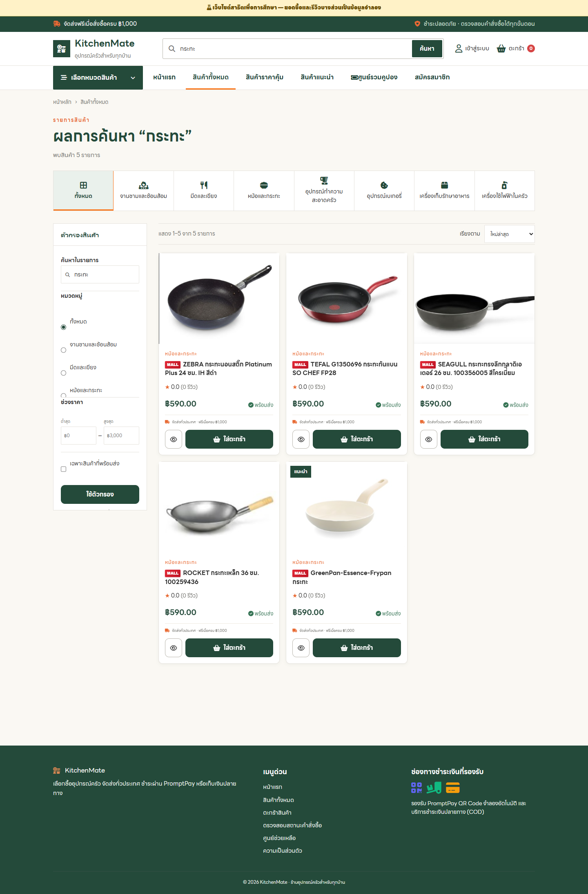
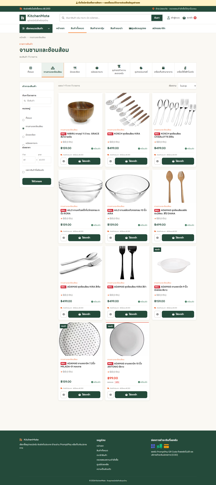
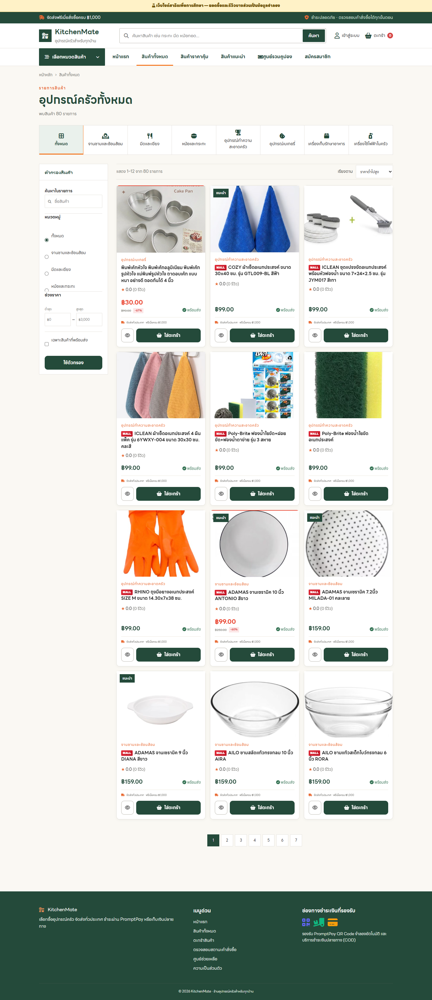
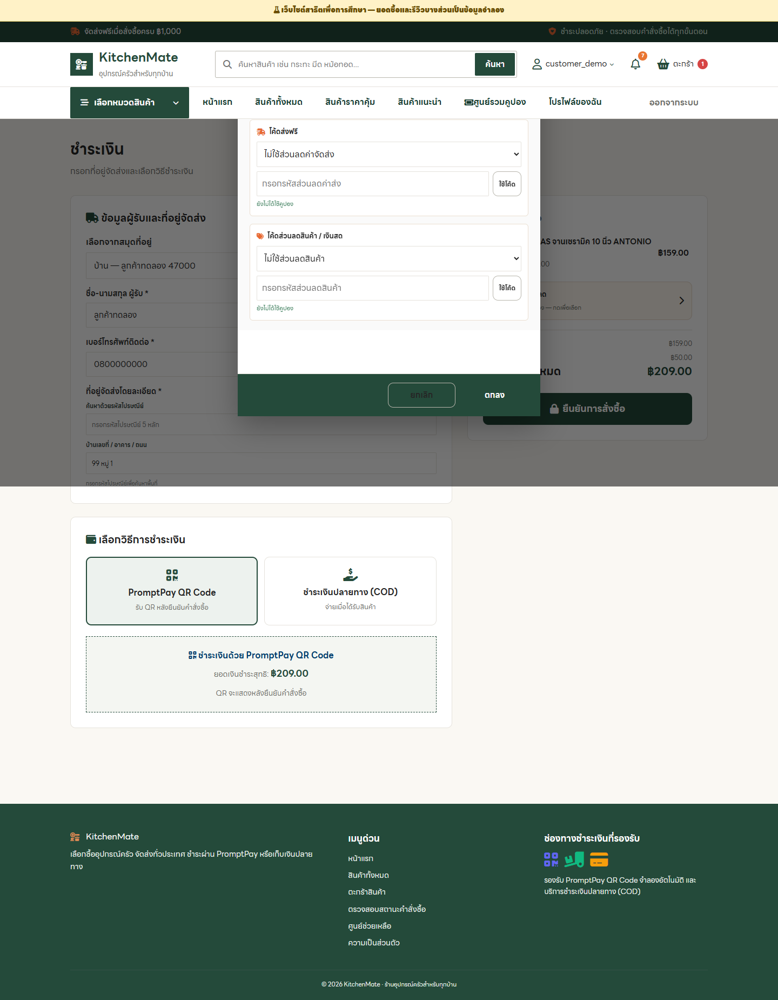
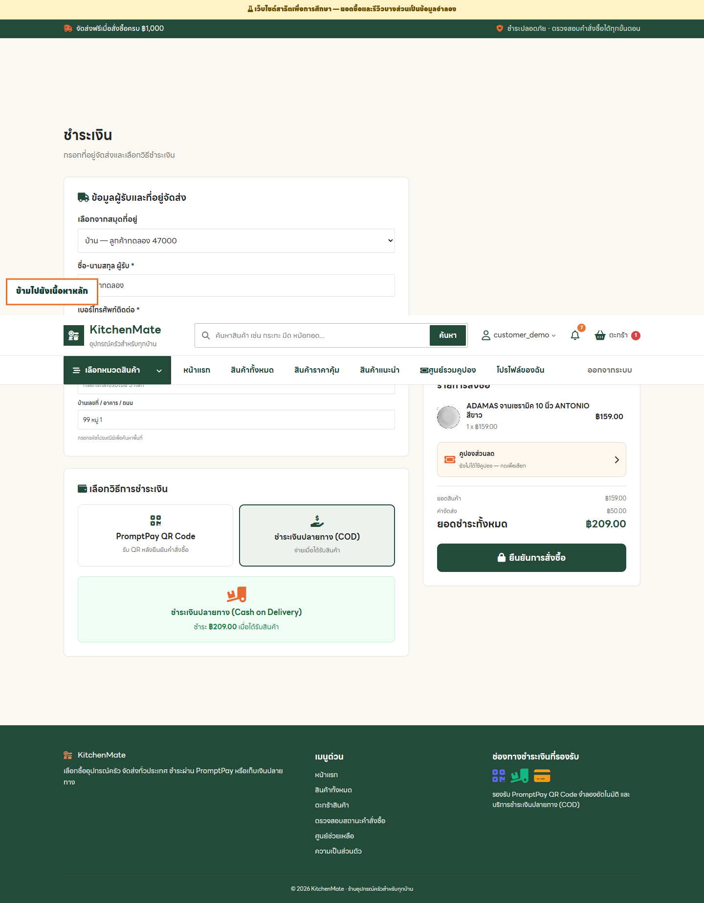
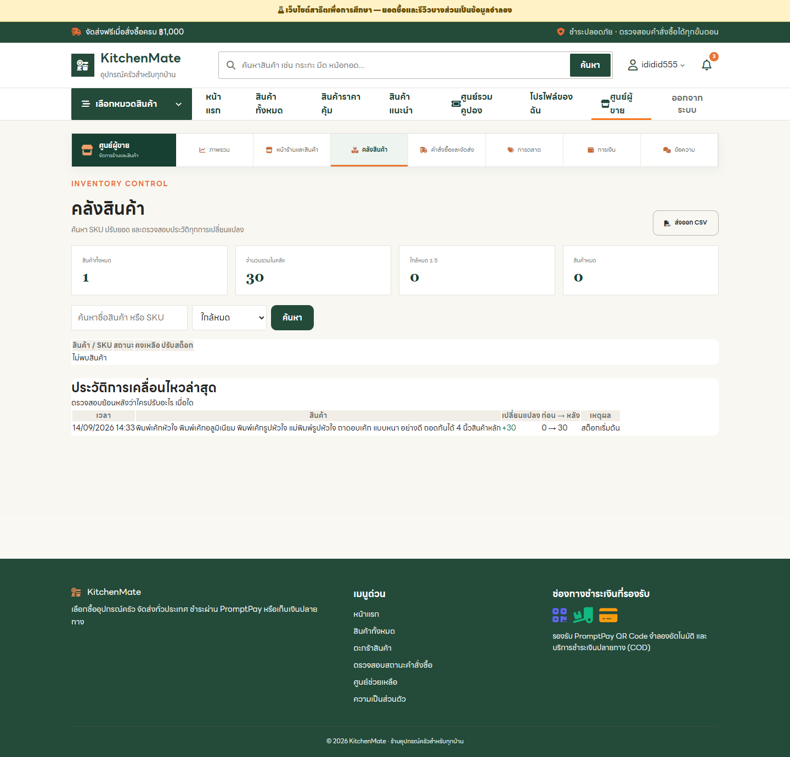
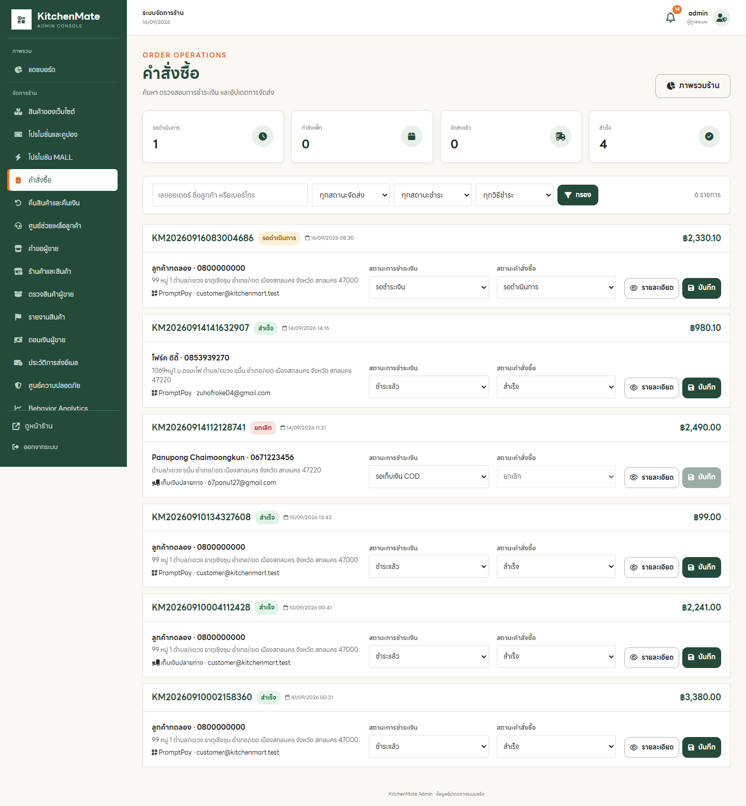

# ตัวอย่างการใช้งานย่อย

ภาพเพิ่มเติมหลังเลือกตัวกรองหรือเปิดส่วนโต้ตอบของหน้าเว็บ

## 01. ค้นหาสินค้า

พิมพ์คำค้นในช่องค้นหาหรือเปิดผลลัพธ์การค้นหาเพื่อดูสินค้าที่ตรงคำ

**หน้า:** `products.php?q=กระทะ`

## 02. กรองหมวดสินค้า

เลือกหมวดจากเมนูเพื่อจำกัดรายการสินค้าที่แสดง

**หน้า:** `products.php?category=1`

## 03. เรียงราคาจากน้อยไปมาก

ใช้ตัวเลือกเรียงลำดับในหน้าสินค้าทั้งหมด

**หน้า:** `products.php?sort=price_asc`

## 04. หน้าต่างเลือกคูปอง

เปิดตัวเลือกคูปองในหน้าชำระเงิน ตรวจเงื่อนไขก่อนใช้

**หน้า:** `checkout.php`

## 05. ชำระเงินปลายทาง

เลือกตัวเลือก COD ในหน้าชำระเงินก่อนยืนยันออเดอร์

**หน้า:** `checkout.php`

## 06. กรองสินค้าใกล้หมด

ใช้ตัวกรองสินค้าใกล้หมดในคลังสินค้า

**หน้า:** `seller-inventory.php?stock=low`

## 07. กรองออเดอร์รอดำเนินการ

เลือกสถานะรอดำเนินการในหน้าคำสั่งซื้อแอดมิน

**หน้า:** `admin/orders.php?status=pending`
