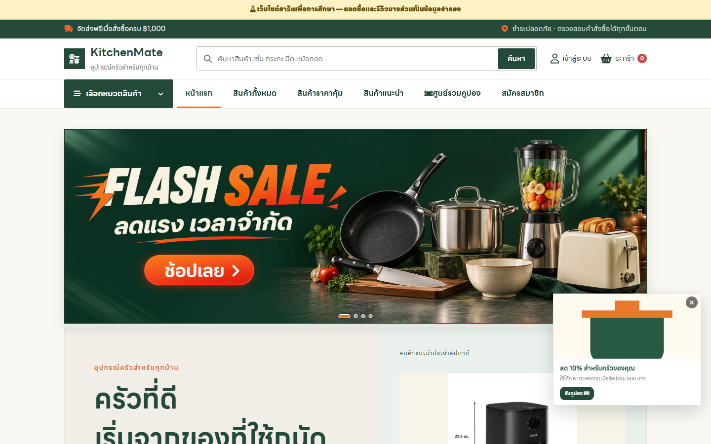

# ชุดภาพหน้าจอ KitchenMate

ถ่ายจากเว็บไซต์ที่รันบนเครื่องนี้เมื่อ 16 กันยายน 2026 ขนาดหน้าต่าง 1440 × 900 พิกเซล ภาพเป็นหน้าจอจริงของระบบและเก็บแบบเต็มหน้า

**รวม 60 ภาพ**: 52 หน้าหลัก, 7 สถานะการใช้งาน และภาพโปรโมชันหน้าแรกอีก 1 ภาพ

## เริ่มอ่านตามบทบาท

- [01 เว็บสำหรับผู้เยี่ยมชม](01_public/README.md)
- [02 บัญชีลูกค้า](02_customer/README.md)
- [03 ระบบผู้ขาย](03_seller/README.md)
- [04 ระบบแอดมิน](04_admin/README.md)
- [05 ตัวอย่างการใช้งานย่อย](05_interactions/README.md)

## เส้นทางสาธิตที่แนะนำ

1. ผู้เยี่ยมชม: หน้าแรก → ค้นหา/กรอง → รายละเอียดสินค้า → สมัครหรือเข้าสู่ระบบ
2. ลูกค้า: ตะกร้า → ชำระเงิน → เลือกคูปอง/วิธีจ่าย → คำสั่งซื้อ → บริการหลังการขาย
3. ผู้ขาย: แดชบอร์ด → ร้านค้าและสินค้า → สต็อก → ออเดอร์ → กระเป๋าเงิน
4. แอดมิน: แดชบอร์ด → สินค้า/ผู้ขาย → ออเดอร์/คืนสินค้า → โปรโมชัน → ข้อมูลและความปลอดภัย

## ขอบเขตของภาพ

ภาพลูกค้า ผู้ขาย และแอดมินใช้เซสชันชั่วคราวสำหรับเก็บภาพโดยไม่เปลี่ยนรหัสผ่านหรือสร้างคำสั่งซื้อใหม่ ภาพชำระเงินมีสินค้าในตะกร้าชั่วคราว 1 รายการ ภาพหน้าสั่งซื้อสำเร็จเปิดจากออเดอร์ที่มีอยู่ ภาพนี้อาจแสดงข้อมูลบัญชีและออเดอร์ที่อยู่ในฐานข้อมูลของเครื่อง ควรตรวจข้อมูลก่อนนำไปเผยแพร่ภายนอก

สถานะที่ต้องใช้ลิงก์ยืนยันหรือรหัสจริง เช่น ยืนยันอีเมล ตั้งรหัสผ่านใหม่หลังคลิกลิงก์ และการยืนยันสองขั้นตอน ไม่ได้สร้างธุรกรรมเพื่อถ่ายภาพ ชุดนี้ครอบคลุมหน้าที่เปิดดูได้และสถานะโต้ตอบหลัก

## ไฟล์ประกอบ

- `manifest.json` ระบุชื่อหน้า เส้นทาง URL และสถานะการเก็บภาพ 52 หน้า
- `05_interactions/manifest.json` ระบุภาพสถานะเพิ่มเติม 7 ภาพ
- รูป `.png` ในแต่ละโฟลเดอร์เป็นภาพต้นฉบับเต็มหน้า

## ภาพโปรโมชันหน้าแรก

